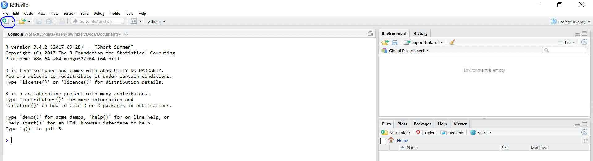

```{r, echo=FALSE, warning=FALSE}
library(knitr)
#rm(list = ls())
#This code automatically tidies code so that it does not reach over the page
opts_chunk$set(tidy.opts=list(width.cutoff=50),tidy=TRUE, rownames.print = FALSE, rows.print = 10)
```

# (PART) Assignments {-}

# R Markdown 


## Introduction to R Markdown

::: {.infobox .download data-latex="{download}"}
[You can download the example markdown file here](./Code/rmarkdown_example.Rmd)
:::

This page will guide you through creating and editing R Markdown documents. This is a useful tool for reporting your analysis (e.g. for homework assignments). Of course, there is also [a cheat sheet for R-Markdown](https://www.rstudio.org/links/r_markdown_cheat_sheet) and [this book](https://bookdown.org/yihui/rmarkdown/) contains a comprehensive discussion of the format. 

The following video contains a short introduction to the R Markdown format.

<br>
<div align="center">
<iframe width="560" height="315" src="https://www.youtube.com/embed/o8FdyMAR-g4" frameborder="0" allowfullscreen></iframe>
</div>
<br>

### Creating a new R Markdown document {-}

In addition to the video, the following text contains a short description of the most important formatting options.  

Let's start to go through the steps of creating and .Rmd file and outputting the content to an HTML file. 

0. If an R-Markdown file was provided to you, open it with R-Studio and skip to [step 4](#step4) after adding your answers.

1. Open R-Studio

2. Create a new R-Markdown document



3. Save with appropriate name


    3.1. Add your answers

    3.2. Save again

 <a name="step4"></a>
 
4. "Knit" to HTML 


5. Hand in appropriate file (ending in `.html`) on learn\@WU


### Text and Equations {-}

R-Markdown documents are plain text files that include both text and R-code. Using RStudio they can be converted ('knitted') to HTML or PDF files that include both the text and the results of the R-code. In fact this website is written using R-Markdown and RStudio. In order for RStudio to be able to interpret the document you have to use certain characters or combinations of characters when formatting text and including R-code to be evaluated. By default the document starts with the options for the text part. You can change the title, date, author and a few more advanced options. 


The default is text mode, meaning that lines in an Rmd document will be interpreted as text, unless specified otherwise.

#### Headings {-}

Usually you want to include some kind of heading to structure your text. A heading is created using `#` signs. A single `#` creates a first level heading, two `##` a second level and so on. 


It is important to note here that the ```#``` symbol means something different within the code chunks as opposed to outside of them. If you continue to put a ```#``` in front of all your regular text, it will all be interpreted as a first level heading, making your text very large.

#### Lists {-}

Bullet point lists are created using `*`, `+` or `-`. Sub-items are created by indenting the item using 4 spaces or 2 tabs. 

````
* First Item
* Second Item
    + first sub-item
        - first sub-sub-item
    + second sub-item
````
* First Item
* Second Item
    + first sub-item
        - first sub-sub-item
    + second sub-item


Ordered lists can be created using numbers and letters. If you need sub-sub-items use `A)` instead of `A.` on the third level. 

````
1. First item
    a. first sub-item
        A) first sub-sub-item 
     b. second sub-item
2. Second item
````

1. First item
    a. first sub-item
        A) first sub-sub-item
    b. second sub-item
2. Second item


#### Text formatting {-}

Text can be formatted in *italics* (`*italics*`) or **bold** (`**bold**`). In addition, you can ad block quotes with `>`

````
> Lorem ipsum dolor amet chillwave lomo ramps, four loko green juice messenger bag raclette forage offal shoreditch chartreuse austin. Slow-carb poutine meggings swag blog, pop-up salvia taxidermy bushwick freegan ugh poke.
````
> Lorem ipsum dolor amet chillwave lomo ramps, four loko green juice messenger bag raclette forage offal shoreditch chartreuse austin. Slow-carb poutine meggings swag blog, pop-up salvia taxidermy bushwick freegan ugh poke.

### R-Code {-}

R-code is contained in so called "chunks". These chunks always start with three backticks and ```r``` in curly braces (``` ```{r} ```) and end with three backticks (``` ``` ```). Optionally, parameters can be added after the ```r``` to influence how a chunk behaves. Additionally, you can also give each chunk a name. Note that these have to be **unique**, otherwise R will refuse to knit your document.

#### Global and chunk options {-}

The first chunk always looks as follows


    ```{r setup, include = FALSE}`r ''`
    knitr::opts_chunk$set(echo = TRUE)
    ```

It is added to the document automatically and sets options for all the following chunks. These options can be overwritten on a per-chunk basis. 

Keep `knitr::opts_chunk$set(echo = TRUE)` to print your code to the document you will hand in. Changing it to `knitr::opts_chunk$set(echo = FALSE)` will not print your code by default. This can be changed on a per-chunk basis.


```{r setup, include=FALSE}
knitr::opts_chunk$set(echo = TRUE)
```

    ```{r cars, echo = FALSE}`r ''`
    summary(cars)

    plot(dist~speed, cars)
    ```


```{r cars, echo = FALSE}
summary(cars)

plot(dist~speed, cars)
```

 
    ```{r cars2, echo = TRUE}`r ''`
    summary(cars)

    plot(dist~speed, cars)
    ```


```{r cars2, echo = TRUE}
summary(cars)

plot(dist~speed, cars)
```

A good overview of all available global/chunk options can be found [here](https://yihui.name/knitr/options/#chunk_options).

### LaTeX Math {-}

Writing well formatted mathematical formulas is done the same way as in [LaTeX](https://en.wikipedia.org/wiki/LaTeX). Math mode is started and ended using `$$`. 
````
$$
 f_1(\omega) = \frac{\sigma^2}{2 \pi},\ \omega \in[-\pi, \pi]
$$
````

$$
 f_1(\omega) = \frac{\sigma^2}{2 \pi},\ \omega \in[-\pi, \pi]
$$

(for those interested this is the spectral density of [white noise](https://en.wikipedia.org/wiki/White_noise))

Including inline mathematical notation is done with a single ```$``` symbol. 

````
${2\over3}$ of my code is inline.

````
${2\over3}$ of my code is inline.

<br>

Take a look at [this wikibook on Mathematics in LaTeX](https://en.wikibooks.org/wiki/LaTeX/Mathematics#Symbols) and [this list of Greek letters and mathematical symbols](https://www.sharelatex.com/learn/List_of_Greek_letters_and_math_symbols) if you are not familiar with LaTeX.

In order to write multi-line equations in the same math environment, use `\\` after every line. In order to insert a space use a single `\`. To render text inside a math environment use `\text{here is the text}`. In order to align equations start with `\begin{align}` and place an `&` in each line at the point around which it should be aligned. Finally end with `\end{align}`

````
$$
\begin{align}
\text{First equation: }\ Y &= X \beta + \epsilon_y,\ \forall X \\
\text{Second equation: }\ X &= Z \gamma + \epsilon_x
\end{align}
$$
````

$$
\begin{align}
\text{First equation: }\ Y &= X \beta + \epsilon_y,\ \forall X \\
\text{Second equation: }\ X &= Z \gamma + \epsilon_x
\end{align}
$$

#### Important symbols {-}

```{r, echo=FALSE, include=TRUE, results="asis", warning = FALSE}
library(knitr)
library(kableExtra)

lat <- readLines("./lat.txt")

lat1 <- paste0("$", lat, "$")
lat2 <- paste0("```", lat, "```")

mathy.df <- data.frame(Symbol = lat1, Code = lat2) 

kable(mathy.df, escape=FALSE) %>%
  kable_styling(bootstrap_options = "striped", full_width = F)
```

The `{}` after `_` and `^` are not strictly necessary if there is only one character in the sub-/superscript. However, in order to place multiple characters in the sub-/superscript they are necessary. 
e.g.


```{r, echo=FALSE, include=TRUE, results="asis", warning = FALSE}
lat <- readLines("./lat2.txt")

lat1 <- paste0("$", lat, "$")
lat2 <- paste0("```", lat, "```")

mathy.df <- data.frame(Symbol = lat1, Code = lat2) 

kable(mathy.df, escape=FALSE) %>%
  kable_styling(bootstrap_options = "striped", full_width = F)
```

#### Greek letters {-}

[Greek letters](https://en.wikipedia.org/wiki/Greek_alphabet#Letters) are preceded by a `\` followed by their name (`$\beta$` = $\beta$). In order to capitalize them simply capitalize the first letter of the name (`$\Gamma$` = $\Gamma$).


## Assignment 1: Solution

**Load libraries and data**

```{r load_data, message=FALSE, warning=FALSE, echo=TRUE, eval=TRUE}
library(tidyverse)
music_data <- read.csv2("https://short.wu.ac.at/ma22_musicdata")
str(music_data)
#head(music_data, 2) 
```

First, you should convert the variables to the correct types:  
```{r convert_variables, message=FALSE, warning=FALSE}
library(magrittr)
music_data %<>% mutate(release_date = as.Date(release_date), # convert to date
                explicit = factor(explicit, levels = 0:1, labels = c("not explicit", "explicit")), # convert to factor w. new labels
                label = as.factor(label), # convert to factor with values as labels
                genre = as.factor(genre),
                top10 = as.logical(top10),
                expert_rating = factor(expert_rating, 
                                       levels = c("poor", "fair", "good", "excellent", "masterpiece"), 
                                       ordered = TRUE))
head(music_data, 2)
```


**Task 1**

1. Determine the most popular song by the artist "Billie Eilish".
2. Create a new `data.frame` that only contains songs by "Billie Eilish" (Bonus: Also include songs that feature both Billie Eilish and other artists, see e.g., "lovely (with Khalid)")
3. Save the `data.frame` sorted by success (number of streams) with the most popular songs occurring first.


There might be multiple ways of tackling this task. For example, you could start from question 3 and first create the complete data frame with only Billie's songs, ordered by popularity:  
```{r question_1_1, message = FALSE, warning = FALSE}
billie_eilish <- music_data |> filter(artistName == "Billie Eilish") |> 
                 arrange(desc(streams)) #arrange by number of streams (in descending order)
head(billie_eilish, 4) 
```
  
In that data frame, you could filter out and display the most popular song, using `max()` function:  
```{r question_1_1_1, message = FALSE, warning = FALSE}
filter(billie_eilish, streams == max(streams)) |> select(trackName) #print top-1 song
```
  
OR, as long as this data frame is already saved with the most popular song on top, you can simply take the first element of the data frame:  
```{r question_1_1_2, message = FALSE, warning = FALSE}
billie_eilish[1, 'trackName']
```
  
  
**Bonus:** For finding all songs featuring Billie Eilish, you could use `str_detect()` function from `stringr` package. It searches for all variables in `artistName`, containing the string "Billie Eilish". The rest stays the same:  
```{r question_1_2, message = FALSE, warning = FALSE}
billie_eilish_full <- filter(music_data, str_detect(artistName, "Billie Eilish")) |> #filter all Billie's appearances
                      arrange(desc(streams)) #arrange by number of streams (in descending order)

#filter(billie_eilish_full, streams == max(streams)) |> select(trackName) #print the top-1 song
head(billie_eilish_full, 3) 
```

**Task 2**

Create a new `data.frame` containing the 100 most streamed songs. 

Here you could simply arrange the whole data set by streams and then take 100 first rows using `slice_head()`:
```{r question_2, message = FALSE, warning = FALSE}
top_100 <- arrange(music_data, desc(streams)) |> slice_head(n = 100) 
head(top_100)
```


**Task 3**

1. Determine the most popular genres. 
- Group the data by genre and calculate the total number of streams within each genre. 
- Sort the result to show the most popular genre first.
2. Create a bar plot in which the heights of the bars correspond to the total number of streams within a genre (Bonus: order the bars by their height)

The correct order of the `dplyr` functions would be as follows: you first group the observations by genre, then summarize the streams using `sum()`, and finally arrange the sums of streams. If you create an object, don't forget to print it to show the result:
```{r question_3_1, message = FALSE, warning = FALSE}
genres_popularity <- music_data |> group_by(genre) |> summarize(streams = sum(streams)) |> arrange(desc(streams))
genres_popularity
```


Ideally, you should provide some **textual conclusion**, e.g., "as can be seen, Pop is the most popular genre when the total number of streams is considered".

To create a bar plot, you need the data frame with the sums of streams by labels. Then you should use `ggplot()` function as follows:
```{r message = FALSE, warning = FALSE, fig.cap=c("Total streams by genre"), fig.align="center", echo=TRUE}
genres_popularity <- as.data.frame(genres_popularity)
#head(genres_popularity)

library(colorspace)
ggplot(genres_popularity, 
       aes(x = genre, y = streams)) + 
  geom_col(aes(fill = streams)) + 
  ylab("Total streams") +
  xlab("Genre") + 
  theme_minimal() +
  scale_fill_continuous_sequential(palette = "Purple-Orange") +
  theme(axis.text.x = element_text(angle = 45, vjust = 0.6), legend.title = element_blank())
```


**Bonus:** if you want to reorder the bars to clearly show the most/least popular genres, use function `fct_reorder()` from the package `forcats` (part of `tidyverse`):
```{r message = FALSE, warning = FALSE, fig.cap=c("Total streams by genre, ordered"), fig.align="center", echo=TRUE}
ggplot(genres_popularity, 
       aes(x = genre, y = streams)) + 
  geom_col(aes(x = fct_reorder(genre, streams), fill = streams)) + 
  ylab("Total streams") +
  xlab("Genre") + 
  theme_minimal() +
  scale_fill_continuous_sequential(palette = "Purple-Orange") +
  theme(axis.text.x = element_text(angle = 45, vjust = 0.6), legend.title = element_blank())
```


**Task 4**

1. Rank the music labels by their success (total number of streams of all their songs)
2. Show the total number of streams as well as the average and the median of all songs by label. (Bonus: Also add the artist and track names and the number of streams of each label's top song to the result)

Just like in the previous task, it would be enough to group the observations (in this case, by labels), get the sums of streams, and arrange them:
```{r question_4_1, message = FALSE, warning = FALSE}
music_data |> group_by(label) |> 
  summarize(total_streams = sum(streams)) |> 
  arrange(desc(total_streams))
```

Again, you need to report the result of sorting, e.g., Universal Music is the leader by number of streams of their songs.

To add more descriptive statistics (mean and median), you should also use `summarize()`:
```{r question_4_2, message = FALSE, warning = FALSE}
music_data |> group_by(label) |> 
  summarize(total_streams = sum(streams), avg_streams = mean(streams), median_streams = median(streams)) |> 
  arrange(desc(total_streams))
```

Here, you can compare labels by means: for example, it's already clear that Independent label(s) have more songs than Warner Music, thus it has more total streams; however, Warner Music's songs are more successful than Independent's in average streams.

**Bonus:** to add most popular artists' names and their hit songs, create three more columns using `first()` function from `dplyr` (you need to use `dplyr::first()` because the `first()` function exists in some other R packages):
```{r question_4_3, message = FALSE, warning = FALSE}
music_data |> group_by(label) |> 
  summarize(total_streams = sum(streams), avg_streams = mean(streams), median_streams = median(streams), 
            artist = dplyr::first(artistName, order_by = desc(streams)), song = dplyr::first(trackName, order_by = desc(streams)), 
            song_streams = dplyr::first(streams, order_by = desc(streams))) |> 
  arrange(desc(total_streams))
```


**Task 5**

1. How do genres differ in terms of song features (audio features + song length + explicitness + song age)?
- Select appropriate summary statistics for each of the variables and highlight the differences between genres using the summary statistics.
- Create an appropriate plot showing the differences of "energy" across genres.
   
All audio features, song length and song age are variables measured on a **ratio scale**, which means that we can evaluate their **average values**. We can use `describeBy()` function, which displays mean by default alongside with median and range values. Let's have a look at some of the features:
```{r question_5_1, message = FALSE, warning = FALSE}
library(psych)
describeBy(select(music_data, danceability, energy, speechiness, 
                  song_length, song_age), music_data$genre)

```

**Please note that it is not enough to simply print the means.** You should always explain (a.k.a. "highlight") the differences between genres in terms of song features:

* on average, Reggae and HipHop are the most danceable genres (their mean danceabilities are 75.06 and 73.05, respectively);
+ Rock songs have the longest average song duration across all genres (3.85 min);
+ Classic and Jazz songs are the oldest (average song age is 819.66 weeks);
+ etc.


However, explicitness is a **categorical (nominal) variable**, i.e., **we cannot use mean or median** to describe genres by explicitness. To describe genres by it, we should get and examine the frequencies of explicit and not explicit songs:
```{r question_5_2, message = FALSE, warning = FALSE}
#table(select(music_data, genre, explicit))  #absolute frequencies
prop.table(table(select(music_data, genre, explicit)), 1) |> round(3) #relative frequencies
```

This can also be visualized with a grouped bar chart:
```{r message = FALSE, warning = FALSE, fig.cap=c("Explicit lyrics share by genre"), fig.align="center", echo=TRUE}
#genres_explicit <- as.data.frame(table(select(music_data, genre, explicit)))  #absolute frequencies
genres_explicit_rel <- as.data.frame(prop.table(table(select(music_data, genre, explicit)), 1))  #relative frequencies

library(colorspace)
ggplot(genres_explicit_rel, 
       aes(x = genre, y = Freq, fill = explicit)) + #use "fill" argument for different colors
  geom_col(position = "dodge") + #use "dodge" to display bars next to each other (instead of stacked on top)
  geom_text(aes(label = sprintf("%.0f%%", Freq * 100)), position = position_dodge(width = 0.9), vjust = -0.25) + #labels in %
  scale_fill_discrete_qualitative(palette = "Dynamic") +
  labs(x = "Genre", y = "Relative frequency") + 
  theme_minimal() +
  scale_fill_discrete_sequential(palette = "PurpOr") +
  theme(axis.text.x = element_text(angle = 45, vjust = 1.1, hjust = 1)) 
```

From the plot above it can be concluded, that Electro/Dance has the greatest share of explicit songs across all genres (34%); Country, in contrast, has the least share of explicit songs (only 2%).

For showing the differences in energy in songs across genres, it would make sense to plot the means of all genres' songs' energy using boxplot:
```{r message = FALSE, warning = FALSE, fig.cap=c("Boxplot of energy by genre"), fig.align="center", echo=TRUE}
ggplot(music_data, 
       aes(x = fct_reorder(genre, energy), y = energy)) + 
  geom_boxplot(coef = 3, fill = "lavenderblush3", color = "thistle4") + 
  labs(x = "Genre", y = "Energy") + 
  theme_minimal() +
  theme(axis.text.x = element_text(angle = 45, vjust = 1.1, hjust = 1), legend.position = "none")
```


Also, you could have a look at the plot of means:
```{r message = FALSE, warning = FALSE, fig.cap=c("Average energy of songs by genre"), fig.align="center", echo=TRUE}
library(Rmisc)
mean_data <- summarySE(music_data, measurevar = "energy",
    groupvars = "genre")
#mean_data

ggplot(mean_data, 
       aes(x = fct_reorder(genre, energy), y = energy)) +
    geom_bar(position = position_dodge(0.9), fill = "lavenderblush3", stat = "identity", width = 0.55) +
    geom_errorbar(position = position_dodge(0.9), width = 0.15, aes(ymin = energy - ci, ymax = energy + ci)) +
    theme_minimal() + 
    labs(x = "Genre", y = "Average energy of songs") +
    theme(axis.text.x = element_text(angle = 45, vjust = 0.8, hjust = 1))
```


**Task 6**

Visualize the number of songs by label. 

"Visualize" means "create a plot". Thus, you should create a bar plot (to show differences in sum of streams by labels, where labels are categorical variables).
It is enough to visualize count of all observations by labels, i.e., it was not necessary to drop duplicates or repeated ISRCs. However, both solutions are correct.
```{r question_6, message = FALSE, warning = FALSE}
labels_songs <- as.data.frame(table(music_data$label))  # frequencies
labels_songs <- dplyr::rename(labels_songs, label = Var1, number_of_songs = Freq)
#labels_songs
```

```{r message = FALSE, warning = FALSE, fig.cap=c("Count of songs by label"), fig.align="center", echo=TRUE}
ggplot(labels_songs, aes(x = label, y = number_of_songs)) + 
  geom_col(width = 0.55, fill = "lavenderblush3") + 
  ylab("Number of songs") +
  xlab("Label") + 
  theme_minimal()
```
Here we can see a confirmation of one of our previous conclusions about the difference in songs count between Warner Music and Independent labels, which resulted in the lower average streams of the latter.

**Task 7**

Visualize the share/relative frequency of songs by genre.

Again, you need to build an appropriate plot. It is a bar plot again, but it illustrates the relative frequencies between number of songs by genres. First, create a data frame with relative frequencies:
```{r question_7, message = FALSE, warning = FALSE}
genres_songs_rel <- as.data.frame(prop.table(table(music_data$genre)))  #relative frequencies
genres_songs_rel <- dplyr::rename(genres_songs_rel, genre = Var1, share = Freq)
#head(genres_songs_rel) 
```

Then create the bar plot as usual:
```{r message = FALSE, warning = FALSE, fig.cap=c("Share of songs by genre"), fig.align="center", echo=TRUE}
ggplot(genres_songs_rel, 
       aes(x = genre, y = share)) + 
  geom_col(aes(fill = share)) + 
  ylab("Share of songs") +
  xlab("Label") + 
  geom_text(aes(label = sprintf("%.0f%%", share * 100)), vjust = -0.2) +
  theme_minimal() +
  scale_fill_continuous_sequential(palette = "Purple-Orange") +
  theme(axis.text.x = element_text(angle = 45, vjust = 0.75))
```


**Task 8**

Create a histogram of the variable "valence".

This is a simple plot of valence distribution across all songs in your data (we can see that it follows normal distribution):
```{r message = FALSE, warning = FALSE, fig.cap=c("Distribution of valence"), fig.align="center", echo=TRUE}
music_data |>
    ggplot(aes(valence)) + 
    geom_histogram(binwidth = 4, col = "white", fill = "lavenderblush3") + labs(x = "Valence",y = "Frequency") +
    theme_minimal()
```

**Task 9**

Create a scatter plot showing "valence" and "speechiness" (Bonus: add a regression line).

Finally, we can visualize the relationship between valence and speechiness of songs in our data:
```{r message = FALSE, warning = FALSE, fig.cap=c("Scatterplot of speechiness and valence"), fig.align="center", echo=TRUE}
ggplot(music_data, 
       aes(speechiness, valence)) +
    geom_point(shape = 1) + labs(x = "Speechiness", y = "Valence") +
    labs(x = "Speechiness", y = "Valence") +
    theme_minimal()
```

**Bonus:** to add regression line, use `geom_smooth()` function:
```{r message = FALSE, warning = FALSE, fig.cap=c("Scatterplot of speechiness and valence"), fig.align="center", echo=TRUE, eval=TRUE}
ggplot(music_data, 
       aes(speechiness, valence)) +
    geom_point(shape = 1) + labs(x = "Speechiness", y = "Valence") +
    geom_smooth(method = "lm", color = "lavenderblush4", alpha = 0.1) + #add regression line
    labs(x = "Speechiness", y = "Valence") +
    theme_minimal()
```
The slope of the regression line suggests that there is positive relationship between valence and speechiness.

