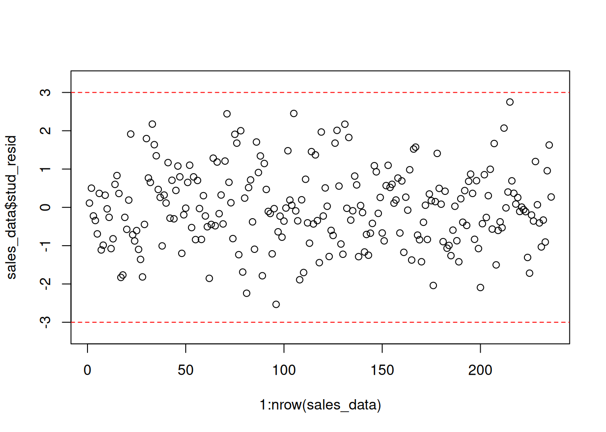
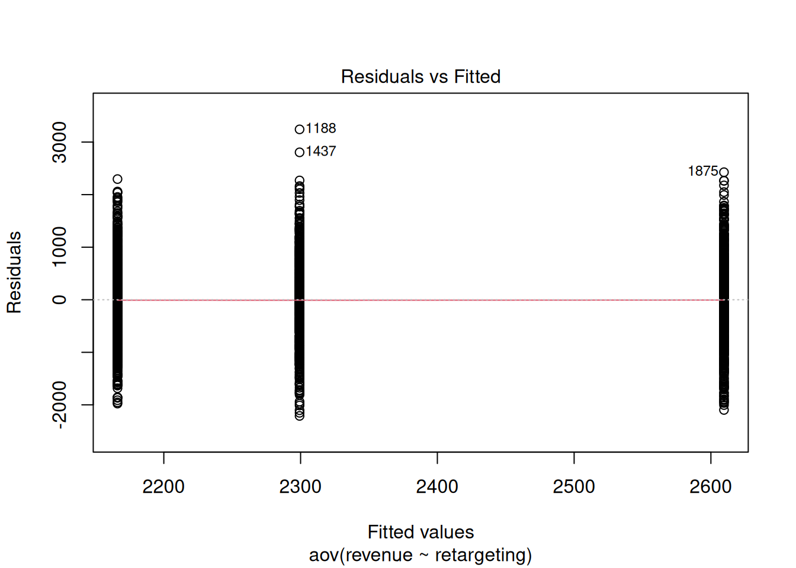

# (PART) Assignments {-}

# R Markdown 


## Introduction to R Markdown

::: {.infobox .download data-latex="{download}"}
[You can download the example markdown file here](./Code/rmarkdown_example.Rmd)
:::

This page will guide you through creating and editing R Markdown documents. This is a useful tool for reporting your analysis (e.g. for homework assignments). Of course, there is also [a cheat sheet for R-Markdown](https://www.rstudio.org/links/r_markdown_cheat_sheet) and [this book](https://bookdown.org/yihui/rmarkdown/) contains a comprehensive discussion of the format. 

The following video contains a short introduction to the R Markdown format.

<br>
<div align="center">
<iframe width="560" height="315" src="https://www.youtube.com/embed/o8FdyMAR-g4" frameborder="0" allowfullscreen></iframe>
</div>
<br>

### Creating a new R Markdown document {-}

In addition to the video, the following text contains a short description of the most important formatting options.  

Let's start to go through the steps of creating and .Rmd file and outputting the content to an HTML file. 

0. If an R-Markdown file was provided to you, open it with R-Studio and skip to [step 4](#step4) after adding your answers.

1. Open R-Studio

2. Create a new R-Markdown document


3. Save with appropriate name


    3.1. Add your answers

    3.2. Save again

 <a name="step4"></a>
 
4. "Knit" to HTML 


5. Hand in appropriate file (ending in `.html`) on learn\@WU


### Text and Equations {-}

R-Markdown documents are plain text files that include both text and R-code. Using RStudio they can be converted ('knitted') to HTML or PDF files that include both the text and the results of the R-code. In fact this website is written using R-Markdown and RStudio. In order for RStudio to be able to interpret the document you have to use certain characters or combinations of characters when formatting text and including R-code to be evaluated. By default the document starts with the options for the text part. You can change the title, date, author and a few more advanced options. 


The default is text mode, meaning that lines in an Rmd document will be interpreted as text, unless specified otherwise.

#### Headings {-}

Usually you want to include some kind of heading to structure your text. A heading is created using `#` signs. A single `#` creates a first level heading, two `##` a second level and so on. 


It is important to note here that the ```#``` symbol means something different within the code chunks as opposed to outside of them. If you continue to put a ```#``` in front of all your regular text, it will all be interpreted as a first level heading, making your text very large.

#### Lists {-}

Bullet point lists are created using `*`, `+` or `-`. Sub-items are created by indenting the item using 4 spaces or 2 tabs. 

````
* First Item
* Second Item
    + first sub-item
        - first sub-sub-item
    + second sub-item
````
* First Item
* Second Item
    + first sub-item
        - first sub-sub-item
    + second sub-item


Ordered lists can be created using numbers and letters. If you need sub-sub-items use `A)` instead of `A.` on the third level. 

````
1. First item
    a. first sub-item
        A) first sub-sub-item 
     b. second sub-item
2. Second item
````

1. First item
    a. first sub-item
        A) first sub-sub-item
    b. second sub-item
2. Second item


#### Text formatting {-}

Text can be formatted in *italics* (`*italics*`) or **bold** (`**bold**`). In addition, you can ad block quotes with `>`

````
> Lorem ipsum dolor amet chillwave lomo ramps, four loko green juice messenger bag raclette forage offal shoreditch chartreuse austin. Slow-carb poutine meggings swag blog, pop-up salvia taxidermy bushwick freegan ugh poke.
````
> Lorem ipsum dolor amet chillwave lomo ramps, four loko green juice messenger bag raclette forage offal shoreditch chartreuse austin. Slow-carb poutine meggings swag blog, pop-up salvia taxidermy bushwick freegan ugh poke.

### R-Code {-}

R-code is contained in so called "chunks". These chunks always start with three backticks and ```r``` in curly braces (``` ```{r} ```) and end with three backticks (``` ``` ```). Optionally, parameters can be added after the ```r``` to influence how a chunk behaves. Additionally, you can also give each chunk a name. Note that these have to be **unique**, otherwise R will refuse to knit your document.

#### Global and chunk options {-}

The first chunk always looks as follows


    ```{r setup, include = FALSE}
    knitr::opts_chunk$set(echo = TRUE)
    ```

It is added to the document automatically and sets options for all the following chunks. These options can be overwritten on a per-chunk basis. 

Keep `knitr::opts_chunk$set(echo = TRUE)` to print your code to the document you will hand in. Changing it to `knitr::opts_chunk$set(echo = FALSE)` will not print your code by default. This can be changed on a per-chunk basis.


    ```{r cars, echo = FALSE}
    summary(cars)

    plot(dist~speed, cars)
    ```


```
##      speed           dist       
##  Min.   : 4.0   Min.   :  2.00  
##  1st Qu.:12.0   1st Qu.: 26.00  
##  Median :15.0   Median : 36.00  
##  Mean   :15.4   Mean   : 42.98  
##  3rd Qu.:19.0   3rd Qu.: 56.00  
##  Max.   :25.0   Max.   :120.00
```


 
    ```{r cars2, echo = TRUE}
    summary(cars)

    plot(dist~speed, cars)
    ```


```r
summary(cars)
```

```
##      speed           dist       
##  Min.   : 4.0   Min.   :  2.00  
##  1st Qu.:12.0   1st Qu.: 26.00  
##  Median :15.0   Median : 36.00  
##  Mean   :15.4   Mean   : 42.98  
##  3rd Qu.:19.0   3rd Qu.: 56.00  
##  Max.   :25.0   Max.   :120.00
```

```r
plot(dist ~ speed, cars)
```


A good overview of all available global/chunk options can be found [here](https://yihui.name/knitr/options/#chunk_options).

### LaTeX Math {-}

Writing well formatted mathematical formulas is done the same way as in [LaTeX](https://en.wikipedia.org/wiki/LaTeX). Math mode is started and ended using `$$`. 
````
$$
 f_1(\omega) = \frac{\sigma^2}{2 \pi},\ \omega \in[-\pi, \pi]
$$
````

$$
 f_1(\omega) = \frac{\sigma^2}{2 \pi},\ \omega \in[-\pi, \pi]
$$

(for those interested this is the spectral density of [white noise](https://en.wikipedia.org/wiki/White_noise))

Including inline mathematical notation is done with a single ```$``` symbol. 

````
${2\over3}$ of my code is inline.

````
${2\over3}$ of my code is inline.

<br>

Take a look at [this wikibook on Mathematics in LaTeX](https://en.wikibooks.org/wiki/LaTeX/Mathematics#Symbols) and [this list of Greek letters and mathematical symbols](https://www.sharelatex.com/learn/List_of_Greek_letters_and_math_symbols) if you are not familiar with LaTeX.

In order to write multi-line equations in the same math environment, use `\\` after every line. In order to insert a space use a single `\`. To render text inside a math environment use `\text{here is the text}`. In order to align equations start with `\begin{align}` and place an `&` in each line at the point around which it should be aligned. Finally end with `\end{align}`

````
$$
\begin{align}
\text{First equation: }\ Y &= X \beta + \epsilon_y,\ \forall X \\
\text{Second equation: }\ X &= Z \gamma + \epsilon_x
\end{align}
$$
````

$$
\begin{align}
\text{First equation: }\ Y &= X \beta + \epsilon_y,\ \forall X \\
\text{Second equation: }\ X &= Z \gamma + \epsilon_x
\end{align}
$$

#### Important symbols {-}

<table class="table table-striped" style="width: auto !important; margin-left: auto; margin-right: auto;">
 <thead>
  <tr>
   <th style="text-align:left;"> Symbol </th>
   <th style="text-align:left;"> Code </th>
  </tr>
 </thead>
<tbody>
  <tr>
   <td style="text-align:left;"> $a^{2} + b$ </td>
   <td style="text-align:left;"> ```a^{2} + b``` </td>
  </tr>
  <tr>
   <td style="text-align:left;"> $a^{2+b}$ </td>
   <td style="text-align:left;"> ```a^{2+b}``` </td>
  </tr>
  <tr>
   <td style="text-align:left;"> $a_{1}$ </td>
   <td style="text-align:left;"> ```a_{1}``` </td>
  </tr>
  <tr>
   <td style="text-align:left;"> $a \leq b$ </td>
   <td style="text-align:left;"> ```a \leq b``` </td>
  </tr>
  <tr>
   <td style="text-align:left;"> $a \geq b$ </td>
   <td style="text-align:left;"> ```a \geq b``` </td>
  </tr>
  <tr>
   <td style="text-align:left;"> $a \neq b$ </td>
   <td style="text-align:left;"> ```a \neq b``` </td>
  </tr>
  <tr>
   <td style="text-align:left;"> $a \approx b$ </td>
   <td style="text-align:left;"> ```a \approx b``` </td>
  </tr>
  <tr>
   <td style="text-align:left;"> $a \in (0,1)$ </td>
   <td style="text-align:left;"> ```a \in (0,1)``` </td>
  </tr>
  <tr>
   <td style="text-align:left;"> $a \rightarrow \infty$ </td>
   <td style="text-align:left;"> ```a \rightarrow \infty``` </td>
  </tr>
  <tr>
   <td style="text-align:left;"> $\frac{a}{b}$ </td>
   <td style="text-align:left;"> ```\frac{a}{b}``` </td>
  </tr>
  <tr>
   <td style="text-align:left;"> $\frac{\partial a}{\partial b}$ </td>
   <td style="text-align:left;"> ```\frac{\partial a}{\partial b}``` </td>
  </tr>
  <tr>
   <td style="text-align:left;"> $\sqrt{a}$ </td>
   <td style="text-align:left;"> ```\sqrt{a}``` </td>
  </tr>
  <tr>
   <td style="text-align:left;"> $\sum_{i = 1}^{b} a_i$ </td>
   <td style="text-align:left;"> ```\sum_{i = 1}^{b} a_i``` </td>
  </tr>
  <tr>
   <td style="text-align:left;"> $\int_{a}^b f(c) dc$ </td>
   <td style="text-align:left;"> ```\int_{a}^b f(c) dc``` </td>
  </tr>
  <tr>
   <td style="text-align:left;"> $\prod_{i = 0}^b a_i$ </td>
   <td style="text-align:left;"> ```\prod_{i = 0}^b a_i``` </td>
  </tr>
  <tr>
   <td style="text-align:left;"> $c \left( \sum_{i=1}^b a_i \right)$ </td>
   <td style="text-align:left;"> ```c \left( \sum_{i=1}^b a_i \right)``` </td>
  </tr>
</tbody>
</table>

The `{}` after `_` and `^` are not strictly necessary if there is only one character in the sub-/superscript. However, in order to place multiple characters in the sub-/superscript they are necessary. 
e.g.


<table class="table table-striped" style="width: auto !important; margin-left: auto; margin-right: auto;">
 <thead>
  <tr>
   <th style="text-align:left;"> Symbol </th>
   <th style="text-align:left;"> Code </th>
  </tr>
 </thead>
<tbody>
  <tr>
   <td style="text-align:left;"> $a^b = a^{b}$ </td>
   <td style="text-align:left;"> ```a^b = a^{b}``` </td>
  </tr>
  <tr>
   <td style="text-align:left;"> $a^b+c \neq a^{b+c}$ </td>
   <td style="text-align:left;"> ```a^b+c \neq a^{b+c}``` </td>
  </tr>
  <tr>
   <td style="text-align:left;"> $\sum_i a_i = \sum_{i} a_{i}$ </td>
   <td style="text-align:left;"> ```\sum_i a_i = \sum_{i} a_{i}``` </td>
  </tr>
  <tr>
   <td style="text-align:left;"> $\sum_{i=1}^{b+c} a_i \neq \sum_i=1^b+c a_i$ </td>
   <td style="text-align:left;"> ```\sum_{i=1}^{b+c} a_i \neq \sum_i=1^b+c a_i``` </td>
  </tr>
</tbody>
</table>

#### Greek letters {-}

[Greek letters](https://en.wikipedia.org/wiki/Greek_alphabet#Letters) are preceded by a `\` followed by their name (`$\beta$` = $\beta$). In order to capitalize them simply capitalize the first letter of the name (`$\Gamma$` = $\Gamma$).


## Assignment 1: Solution

**Load libraries and data**


```r
library(tidyverse)
music_data <- read.csv2("https://short.wu.ac.at/ma22_musicdata")
str(music_data)
```

```
## 'data.frame':	66796 obs. of  31 variables:
##  $ isrc                       : chr  "BRRGE1603547" "USUM71808193" "ES5701800181" "ITRSE2000050" ...
##  $ artist_id                  : int  3679 5239 776407 433730 526471 1939 210184 212546 4938 119985 ...
##  $ streams                    : num  11944813 8934097 38835 46766 2930573 ...
##  $ weeks_in_charts            : int  141 51 1 1 7 226 13 1 64 7 ...
##  $ n_regions                  : int  1 21 1 1 4 8 1 1 5 1 ...
##  $ danceability               : num  50.9 35.3 68.3 70.4 84.2 35.2 73 55.6 71.9 34.6 ...
##  $ energy                     : num  80.3 75.5 67.6 56.8 57.8 91.1 69.6 24.5 85 43.3 ...
##  $ speechiness                : num  4 73.3 14.7 26.8 13.8 7.47 35.5 3.05 3.17 6.5 ...
##  $ instrumentalness           : num  0.05 0 0 0.000253 0 0 0 0 0.02 0 ...
##  $ liveness                   : num  46.3 39 7.26 8.91 22.8 9.95 32.1 9.21 11.4 10.1 ...
##  $ valence                    : num  65.1 43.7 43.4 49.5 19 23.6 58.4 27.6 36.7 76.8 ...
##  $ tempo                      : num  166 191.2 99 91 74.5 ...
##  $ song_length                : num  3.12 3.23 3.02 3.45 3.95 ...
##  $ song_age                   : num  228.3 144.3 112.3 50.7 58.3 ...
##  $ explicit                   : int  0 0 0 0 0 0 0 0 1 0 ...
##  $ n_playlists                : int  450 768 48 6 475 20591 6 105 547 688 ...
##  $ sp_popularity              : int  51 54 32 44 52 81 44 8 59 68 ...
##  $ youtube_views              : num  1.45e+08 1.32e+07 6.12e+06 0.00 0.00 ...
##  $ tiktok_counts              : int  9740 358700 0 13 515 67300 0 0 653 3807 ...
##  $ ins_followers_artist       : int  29613108 3693566 623778 81601 11962358 1169284 1948850 39381 9751080 343 ...
##  $ monthly_listeners_artist   : int  4133393 18367363 888273 143761 15551876 16224250 2683086 1318874 4828847 3088232 ...
##  $ playlist_total_reach_artist: int  24286416 143384531 4846378 156521 90841884 80408253 7332603 24302331 8914977 8885252 ...
##  $ sp_fans_artist             : int  3308630 465412 23846 1294 380204 1651866 214001 10742 435457 1897685 ...
##  $ shazam_counts              : int  73100 588550 0 0 55482 5281161 0 0 39055 0 ...
##  $ artistName                 : chr  "Luan Santana" "Alessia Cara" "Ana Guerra" "Claver Gold feat. Murubutu" ...
##  $ trackName                  : chr  "Eu, Você, O Mar e Ela" "Growing Pains" "El Remedio" "Ulisse" ...
##  $ release_date               : chr  "2016-06-20" "2018-06-14" "2018-04-26" "2020-03-31" ...
##  $ genre                      : chr  "other" "Pop" "Pop" "HipHop/Rap" ...
##  $ label                      : chr  "Independent" "Universal Music" "Universal Music" "Independent" ...
##  $ top10                      : int  1 0 0 0 0 1 0 0 0 0 ...
##  $ expert_rating              : chr  "excellent" "good" "good" "poor" ...
```

```r
# head(music_data, 2)
```

First, you should convert the variables to the correct types:  

```r
library(magrittr)
music_data %<>% mutate(release_date = as.Date(release_date), # convert to date
                explicit = factor(explicit, levels = 0:1, labels = c("not explicit", "explicit")), # convert to factor w. new labels
                label = as.factor(label), # convert to factor with values as labels
                genre = as.factor(genre),
                top10 = as.logical(top10),
                expert_rating = factor(expert_rating, 
                                       levels = c("poor", "fair", "good", "excellent", "masterpiece"), 
                                       ordered = TRUE))
head(music_data, 2)
```

<div data-pagedtable="false">
  <script data-pagedtable-source type="application/json">
{"columns":[{"label":["isrc"],"name":[1],"type":["chr"],"align":["left"]},{"label":["artist_id"],"name":[2],"type":["int"],"align":["right"]},{"label":["streams"],"name":[3],"type":["dbl"],"align":["right"]},{"label":["weeks_in_charts"],"name":[4],"type":["int"],"align":["right"]},{"label":["n_regions"],"name":[5],"type":["int"],"align":["right"]},{"label":["danceability"],"name":[6],"type":["dbl"],"align":["right"]},{"label":["energy"],"name":[7],"type":["dbl"],"align":["right"]},{"label":["speechiness"],"name":[8],"type":["dbl"],"align":["right"]},{"label":["instrumentalness"],"name":[9],"type":["dbl"],"align":["right"]},{"label":["liveness"],"name":[10],"type":["dbl"],"align":["right"]},{"label":["valence"],"name":[11],"type":["dbl"],"align":["right"]},{"label":["tempo"],"name":[12],"type":["dbl"],"align":["right"]},{"label":["song_length"],"name":[13],"type":["dbl"],"align":["right"]},{"label":["song_age"],"name":[14],"type":["dbl"],"align":["right"]},{"label":["explicit"],"name":[15],"type":["fct"],"align":["left"]},{"label":["n_playlists"],"name":[16],"type":["int"],"align":["right"]},{"label":["sp_popularity"],"name":[17],"type":["int"],"align":["right"]},{"label":["youtube_views"],"name":[18],"type":["dbl"],"align":["right"]},{"label":["tiktok_counts"],"name":[19],"type":["int"],"align":["right"]},{"label":["ins_followers_artist"],"name":[20],"type":["int"],"align":["right"]},{"label":["monthly_listeners_artist"],"name":[21],"type":["int"],"align":["right"]},{"label":["playlist_total_reach_artist"],"name":[22],"type":["int"],"align":["right"]},{"label":["sp_fans_artist"],"name":[23],"type":["int"],"align":["right"]},{"label":["shazam_counts"],"name":[24],"type":["int"],"align":["right"]},{"label":["artistName"],"name":[25],"type":["chr"],"align":["left"]},{"label":["trackName"],"name":[26],"type":["chr"],"align":["left"]},{"label":["release_date"],"name":[27],"type":["date"],"align":["right"]},{"label":["genre"],"name":[28],"type":["fct"],"align":["left"]},{"label":["label"],"name":[29],"type":["fct"],"align":["left"]},{"label":["top10"],"name":[30],"type":["lgl"],"align":["right"]},{"label":["expert_rating"],"name":[31],"type":["ord"],"align":["right"]}],"data":[{"1":"BRRGE1603547","2":"3679","3":"11944813","4":"141","5":"1","6":"50.9","7":"80.3","8":"4.0","9":"0.05","10":"46.3","11":"65.1","12":"166.018","13":"3.11865","14":"228.2857","15":"not explicit","16":"450","17":"51","18":"145030723","19":"9740","20":"29613108","21":"4133393","22":"24286416","23":"3308630","24":"73100","25":"Luan Santana","26":"Eu, Você, O Mar e Ela","27":"2016-06-20","28":"other","29":"Independent","30":"TRUE","31":"excellent"},{"1":"USUM71808193","2":"5239","3":"8934097","4":"51","5":"21","6":"35.3","7":"75.5","8":"73.3","9":"0.00","10":"39.0","11":"43.7","12":"191.153","13":"3.22800","14":"144.2857","15":"not explicit","16":"768","17":"54","18":"13188411","19":"358700","20":"3693566","21":"18367363","22":"143384531","23":"465412","24":"588550","25":"Alessia Cara","26":"Growing Pains","27":"2018-06-14","28":"Pop","29":"Universal Music","30":"FALSE","31":"good"}],"options":{"columns":{"min":{},"max":[10]},"rows":{"min":[10],"max":[10]},"pages":{}}}
  </script>
</div>


**Task 1**

1. Determine the most popular song by the artist "Billie Eilish".
2. Create a new `data.frame` that only contains songs by "Billie Eilish" (Bonus: Also include songs that feature both Billie Eilish and other artists, see e.g., "lovely (with Khalid)")
3. Save the `data.frame` sorted by success (number of streams) with the most popular songs occurring first.


There might be multiple ways of tackling this task. For example, you could start from question 3 and first create the complete data frame with only Billie's songs, ordered by popularity:  

```r
billie_eilish <- music_data |>
    filter(artistName == "Billie Eilish") |>
    arrange(desc(streams))  #arrange by number of streams (in descending order)
head(billie_eilish, 4)
```

<div data-pagedtable="false">
  <script data-pagedtable-source type="application/json">
{"columns":[{"label":["isrc"],"name":[1],"type":["chr"],"align":["left"]},{"label":["artist_id"],"name":[2],"type":["int"],"align":["right"]},{"label":["streams"],"name":[3],"type":["dbl"],"align":["right"]},{"label":["weeks_in_charts"],"name":[4],"type":["int"],"align":["right"]},{"label":["n_regions"],"name":[5],"type":["int"],"align":["right"]},{"label":["danceability"],"name":[6],"type":["dbl"],"align":["right"]},{"label":["energy"],"name":[7],"type":["dbl"],"align":["right"]},{"label":["speechiness"],"name":[8],"type":["dbl"],"align":["right"]},{"label":["instrumentalness"],"name":[9],"type":["dbl"],"align":["right"]},{"label":["liveness"],"name":[10],"type":["dbl"],"align":["right"]},{"label":["valence"],"name":[11],"type":["dbl"],"align":["right"]},{"label":["tempo"],"name":[12],"type":["dbl"],"align":["right"]},{"label":["song_length"],"name":[13],"type":["dbl"],"align":["right"]},{"label":["song_age"],"name":[14],"type":["dbl"],"align":["right"]},{"label":["explicit"],"name":[15],"type":["fct"],"align":["left"]},{"label":["n_playlists"],"name":[16],"type":["int"],"align":["right"]},{"label":["sp_popularity"],"name":[17],"type":["int"],"align":["right"]},{"label":["youtube_views"],"name":[18],"type":["dbl"],"align":["right"]},{"label":["tiktok_counts"],"name":[19],"type":["int"],"align":["right"]},{"label":["ins_followers_artist"],"name":[20],"type":["int"],"align":["right"]},{"label":["monthly_listeners_artist"],"name":[21],"type":["int"],"align":["right"]},{"label":["playlist_total_reach_artist"],"name":[22],"type":["int"],"align":["right"]},{"label":["sp_fans_artist"],"name":[23],"type":["int"],"align":["right"]},{"label":["shazam_counts"],"name":[24],"type":["int"],"align":["right"]},{"label":["artistName"],"name":[25],"type":["chr"],"align":["left"]},{"label":["trackName"],"name":[26],"type":["chr"],"align":["left"]},{"label":["release_date"],"name":[27],"type":["date"],"align":["right"]},{"label":["genre"],"name":[28],"type":["fct"],"align":["left"]},{"label":["label"],"name":[29],"type":["fct"],"align":["left"]},{"label":["top10"],"name":[30],"type":["lgl"],"align":["right"]},{"label":["expert_rating"],"name":[31],"type":["ord"],"align":["right"]}],"data":[{"1":"USUM71900764","2":"5596","3":"1459149566","4":"724","5":"35","6":"70.1","7":"42.5","8":"37.50","9":"13.0","10":"10.0","11":"56.2","12":"135.128","13":"3.234800","14":"103.28571","15":"not explicit","16":"10226","17":"87","18":"1070192329","19":"140000","20":"78388337","21":"47632687","22":"223834163","23":"4355854","24":"15967622","25":"Billie Eilish","26":"bad guy","27":"2019-03-28","28":"Rock","29":"Universal Music","30":"TRUE","31":"good"},{"1":"USUM71922577","2":"5596","3":"594991676","4":"491","5":"35","6":"70.4","7":"22.5","8":"9.94","9":"65.7","10":"10.6","11":"24.3","12":"120.006","13":"4.090433","14":"70.57143","15":"not explicit","16":"5459","17":"86","18":"210598263","19":"71500","20":"78388337","21":"47632687","22":"223834163","23":"4355854","24":"7180495","25":"Billie Eilish","26":"everything i wanted","27":"2019-11-13","28":"Rock","29":"Universal Music","30":"TRUE","31":"good"},{"1":"USUM71900770","2":"5596","3":"298707880","4":"382","5":"35","6":"90.5","7":"38.9","8":"33.20","9":"16.2","10":"10.6","11":"19.6","12":"120.046","13":"3.219050","14":"103.28571","15":"not explicit","16":"4261","17":"79","18":"399709135","19":"8511","20":"78388337","21":"47632687","22":"223834163","23":"4355854","24":"2755292","25":"Billie Eilish","26":"bury a friend","27":"2019-01-30","28":"Rock","29":"Universal Music","30":"TRUE","31":"good"},{"1":"USUM72021500","2":"5596","3":"269394372","4":"129","5":"35","6":"88.9","7":"34.0","8":"6.97","9":"13.0","10":"5.5","11":"71.6","12":"94.009","13":"2.905350","14":"18.42857","15":"not explicit","16":"2692","17":"91","18":"141648329","19":"3100000","20":"78388337","21":"47632687","22":"223834163","23":"4355854","24":"2185476","25":"Billie Eilish","26":"Therefore I Am","27":"2020-11-12","28":"Rock","29":"Universal Music","30":"TRUE","31":"masterpiece"}],"options":{"columns":{"min":{},"max":[10]},"rows":{"min":[10],"max":[10]},"pages":{}}}
  </script>
</div>
  
In that data frame, you could filter out and display the most popular song, using `max()` function:  

```r
filter(billie_eilish, streams == max(streams)) |>
    select(trackName)  #print top-1 song
```

<div data-pagedtable="false">
  <script data-pagedtable-source type="application/json">
{"columns":[{"label":["trackName"],"name":[1],"type":["chr"],"align":["left"]}],"data":[{"1":"bad guy"}],"options":{"columns":{"min":{},"max":[10]},"rows":{"min":[10],"max":[10]},"pages":{}}}
  </script>
</div>
  
OR, as long as this data frame is already saved with the most popular song on top, you can simply take the first element of the data frame:  

```r
billie_eilish[1, "trackName"]
```

```
## [1] "bad guy"
```
  
  
**Bonus:** For finding all songs featuring Billie Eilish, you could use `str_detect()` function from `stringr` package. It searches for all variables in `artistName`, containing the string "Billie Eilish". The rest stays the same:  

```r
billie_eilish_full <- filter(music_data, str_detect(artistName, "Billie Eilish")) |> #filter all Billie's appearances
                      arrange(desc(streams)) #arrange by number of streams (in descending order)

#filter(billie_eilish_full, streams == max(streams)) |> select(trackName) #print the top-1 song
head(billie_eilish_full, 3) 
```

<div data-pagedtable="false">
  <script data-pagedtable-source type="application/json">
{"columns":[{"label":["isrc"],"name":[1],"type":["chr"],"align":["left"]},{"label":["artist_id"],"name":[2],"type":["int"],"align":["right"]},{"label":["streams"],"name":[3],"type":["dbl"],"align":["right"]},{"label":["weeks_in_charts"],"name":[4],"type":["int"],"align":["right"]},{"label":["n_regions"],"name":[5],"type":["int"],"align":["right"]},{"label":["danceability"],"name":[6],"type":["dbl"],"align":["right"]},{"label":["energy"],"name":[7],"type":["dbl"],"align":["right"]},{"label":["speechiness"],"name":[8],"type":["dbl"],"align":["right"]},{"label":["instrumentalness"],"name":[9],"type":["dbl"],"align":["right"]},{"label":["liveness"],"name":[10],"type":["dbl"],"align":["right"]},{"label":["valence"],"name":[11],"type":["dbl"],"align":["right"]},{"label":["tempo"],"name":[12],"type":["dbl"],"align":["right"]},{"label":["song_length"],"name":[13],"type":["dbl"],"align":["right"]},{"label":["song_age"],"name":[14],"type":["dbl"],"align":["right"]},{"label":["explicit"],"name":[15],"type":["fct"],"align":["left"]},{"label":["n_playlists"],"name":[16],"type":["int"],"align":["right"]},{"label":["sp_popularity"],"name":[17],"type":["int"],"align":["right"]},{"label":["youtube_views"],"name":[18],"type":["dbl"],"align":["right"]},{"label":["tiktok_counts"],"name":[19],"type":["int"],"align":["right"]},{"label":["ins_followers_artist"],"name":[20],"type":["int"],"align":["right"]},{"label":["monthly_listeners_artist"],"name":[21],"type":["int"],"align":["right"]},{"label":["playlist_total_reach_artist"],"name":[22],"type":["int"],"align":["right"]},{"label":["sp_fans_artist"],"name":[23],"type":["int"],"align":["right"]},{"label":["shazam_counts"],"name":[24],"type":["int"],"align":["right"]},{"label":["artistName"],"name":[25],"type":["chr"],"align":["left"]},{"label":["trackName"],"name":[26],"type":["chr"],"align":["left"]},{"label":["release_date"],"name":[27],"type":["date"],"align":["right"]},{"label":["genre"],"name":[28],"type":["fct"],"align":["left"]},{"label":["label"],"name":[29],"type":["fct"],"align":["left"]},{"label":["top10"],"name":[30],"type":["lgl"],"align":["right"]},{"label":["expert_rating"],"name":[31],"type":["ord"],"align":["right"]}],"data":[{"1":"USUM71900764","2":"5596","3":"1459149566","4":"724","5":"35","6":"70.1","7":"42.5","8":"37.50","9":"13.0","10":"10.0","11":"56.2","12":"135.128","13":"3.234800","14":"103.28571","15":"not explicit","16":"10226","17":"87","18":"1070192329","19":"140000","20":"78388337","21":"47632687","22":"223834163","23":"4355854","24":"15967622","25":"Billie Eilish","26":"bad guy","27":"2019-03-28","28":"Rock","29":"Universal Music","30":"TRUE","31":"good"},{"1":"USUM71804190","2":"5596","3":"736917003","4":"906","5":"35","6":"35.1","7":"29.6","8":"3.33","9":"0.0","10":"9.5","11":"12.0","12":"115.284","13":"3.336433","14":"152.42857","15":"not explicit","16":"6074","17":"88","18":"86414365","19":"24100","20":"78388337","21":"47632687","22":"223834163","23":"4355854","24":"5983153","25":"Billie Eilish feat. Khalid","26":"lovely (with Khalid)","27":"2018-04-19","28":"Rock","29":"Universal Music","30":"TRUE","31":"good"},{"1":"USUM71922577","2":"5596","3":"594991676","4":"491","5":"35","6":"70.4","7":"22.5","8":"9.94","9":"65.7","10":"10.6","11":"24.3","12":"120.006","13":"4.090433","14":"70.57143","15":"not explicit","16":"5459","17":"86","18":"210598263","19":"71500","20":"78388337","21":"47632687","22":"223834163","23":"4355854","24":"7180495","25":"Billie Eilish","26":"everything i wanted","27":"2019-11-13","28":"Rock","29":"Universal Music","30":"TRUE","31":"good"}],"options":{"columns":{"min":{},"max":[10]},"rows":{"min":[10],"max":[10]},"pages":{}}}
  </script>
</div>

**Task 2**

Create a new `data.frame` containing the 100 most streamed songs. 

Here you could simply arrange the whole data set by streams and then take 100 first rows using `slice_head()`:

```r
top_100 <- arrange(music_data, desc(streams)) |>
    slice_head(n = 100)
head(top_100)
```

<div data-pagedtable="false">
  <script data-pagedtable-source type="application/json">
{"columns":[{"label":["isrc"],"name":[1],"type":["chr"],"align":["left"]},{"label":["artist_id"],"name":[2],"type":["int"],"align":["right"]},{"label":["streams"],"name":[3],"type":["dbl"],"align":["right"]},{"label":["weeks_in_charts"],"name":[4],"type":["int"],"align":["right"]},{"label":["n_regions"],"name":[5],"type":["int"],"align":["right"]},{"label":["danceability"],"name":[6],"type":["dbl"],"align":["right"]},{"label":["energy"],"name":[7],"type":["dbl"],"align":["right"]},{"label":["speechiness"],"name":[8],"type":["dbl"],"align":["right"]},{"label":["instrumentalness"],"name":[9],"type":["dbl"],"align":["right"]},{"label":["liveness"],"name":[10],"type":["dbl"],"align":["right"]},{"label":["valence"],"name":[11],"type":["dbl"],"align":["right"]},{"label":["tempo"],"name":[12],"type":["dbl"],"align":["right"]},{"label":["song_length"],"name":[13],"type":["dbl"],"align":["right"]},{"label":["song_age"],"name":[14],"type":["dbl"],"align":["right"]},{"label":["explicit"],"name":[15],"type":["fct"],"align":["left"]},{"label":["n_playlists"],"name":[16],"type":["int"],"align":["right"]},{"label":["sp_popularity"],"name":[17],"type":["int"],"align":["right"]},{"label":["youtube_views"],"name":[18],"type":["dbl"],"align":["right"]},{"label":["tiktok_counts"],"name":[19],"type":["int"],"align":["right"]},{"label":["ins_followers_artist"],"name":[20],"type":["int"],"align":["right"]},{"label":["monthly_listeners_artist"],"name":[21],"type":["int"],"align":["right"]},{"label":["playlist_total_reach_artist"],"name":[22],"type":["int"],"align":["right"]},{"label":["sp_fans_artist"],"name":[23],"type":["int"],"align":["right"]},{"label":["shazam_counts"],"name":[24],"type":["int"],"align":["right"]},{"label":["artistName"],"name":[25],"type":["chr"],"align":["left"]},{"label":["trackName"],"name":[26],"type":["chr"],"align":["left"]},{"label":["release_date"],"name":[27],"type":["date"],"align":["right"]},{"label":["genre"],"name":[28],"type":["fct"],"align":["left"]},{"label":["label"],"name":[29],"type":["fct"],"align":["left"]},{"label":["top10"],"name":[30],"type":["lgl"],"align":["right"]},{"label":["expert_rating"],"name":[31],"type":["ord"],"align":["right"]}],"data":[{"1":"GBAHS1600463","2":"3648","3":"2165692479","4":"1532","5":"35","6":"82.5","7":"65.2","8":"8.02","9":"0.00","10":"9.31","11":"93.1","12":"95.977","13":"3.895217","14":"211.28571","15":"not explicit","16":"28754","17":"86","18":"5225251113","19":"780900","20":"31799118","21":"54645910","22":"333851354","23":"16312741","24":"1137483","25":"Ed Sheeran","26":"Shape of You","27":"2017-01-06","28":"Pop","29":"Warner Music","30":"TRUE","31":"fair"},{"1":"QZES71982312","2":"1410939","3":"1909947000","4":"649","5":"35","6":"82.5","7":"59.3","8":"9.88","9":"0.02","10":"17.00","11":"54.0","12":"98.078","13":"3.495917","14":"97.28571","15":"not explicit","16":"11330","17":"88","18":"1527998214","19":"6700000","20":"689914","21":"23941476","22":"128533003","23":"431389","24":"38107895","25":"Tones and I","26":"Dance Monkey","27":"2019-05-09","28":"Rock","29":"Warner Music","30":"TRUE","31":"excellent"},{"1":"USUM71900764","2":"5596","3":"1459149566","4":"724","5":"35","6":"70.1","7":"42.5","8":"37.50","9":"13.00","10":"10.00","11":"56.2","12":"135.128","13":"3.234800","14":"103.28571","15":"not explicit","16":"10226","17":"87","18":"1070192329","19":"140000","20":"78388337","21":"47632687","22":"223834163","23":"4355854","24":"15967622","25":"Billie Eilish","26":"bad guy","27":"2019-03-28","28":"Rock","29":"Universal Music","30":"TRUE","31":"good"},{"1":"DEUM71807062","2":"550208","3":"1419867299","4":"674","5":"35","6":"50.1","7":"40.5","8":"3.19","9":"0.00","10":"10.50","11":"44.6","12":"109.891","13":"3.036017","14":"96.28571","15":"not explicit","16":"9248","17":"90","18":"346557905","19":"1500000","20":"5581593","21":"29822533","22":"146074472","23":"593695","24":"894017","25":"Lewis Capaldi","26":"Someone You Loved","27":"2018-11-08","28":"Rock","29":"Universal Music","30":"TRUE","31":"excellent"},{"1":"USUM71911283","2":"4934","3":"1156206588","4":"604","5":"35","6":"75.9","7":"54.8","8":"2.90","9":"0.00","10":"8.28","11":"74.9","12":"116.967","13":"3.180000","14":"91.57143","15":"not explicit","16":"9109","17":"83","18":"1215405738","19":"5700000","20":"59448876","21":"42568761","22":"257192162","23":"5613129","24":"12124023","25":"Shawn Mendes feat. Camila Cabello","26":"Señorita","27":"2019-06-19","28":"Pop","29":"Universal Music","30":"TRUE","31":"excellent"},{"1":"USUG11800208","2":"74419","3":"1103693478","4":"1099","5":"35","6":"74.0","7":"61.3","8":"14.50","9":"0.37","10":"12.30","11":"47.3","12":"75.023","13":"2.776767","14":"157.28571","15":"not explicit","16":"9537","17":"86","18":"1028957267","19":"1700000","20":"18761684","21":"27692936","22":"59707763","23":"2547427","24":"2906121","25":"XXXTENTACION","26":"SAD!","27":"2018-03-02","28":"Pop","29":"Universal Music","30":"TRUE","31":"excellent"}],"options":{"columns":{"min":{},"max":[10]},"rows":{"min":[10],"max":[10]},"pages":{}}}
  </script>
</div>


**Task 3**

1. Determine the most popular genres. 
- Group the data by genre and calculate the total number of streams within each genre. 
- Sort the result to show the most popular genre first.
2. Create a bar plot in which the heights of the bars correspond to the total number of streams within a genre (Bonus: order the bars by their height)

The correct order of the `dplyr` functions would be as follows: you first group the observations by genre, then summarize the streams using `sum()`, and finally arrange the sums of streams. If you create an object, don't forget to print it to show the result:

```r
genres_popularity <- music_data |>
    group_by(genre) |>
    summarize(streams = sum(streams)) |>
    arrange(desc(streams))
genres_popularity
```

<div data-pagedtable="false">
  <script data-pagedtable-source type="application/json">
{"columns":[{"label":["genre"],"name":[1],"type":["fct"],"align":["left"]},{"label":["streams"],"name":[2],"type":["dbl"],"align":["right"]}],"data":[{"1":"Pop","2":"173713597202"},{"1":"HipHop/Rap","2":"143116357087"},{"1":"other","2":"65952433233"},{"1":"Electro/Dance","2":"33815774273"},{"1":"Rock","2":"29085255798"},{"1":"R&B","2":"28843269808"},{"1":"Country","2":"7575073860"},{"1":"Soundtrack","2":"4132622529"},{"1":"German Folk","2":"1521744994"},{"1":"Reggae","2":"775976707"},{"1":"Classics/Jazz","2":"58854804"}],"options":{"columns":{"min":{},"max":[10]},"rows":{"min":[10],"max":[10]},"pages":{}}}
  </script>
</div>


Ideally, you should provide some **textual conclusion**, e.g., "as can be seen, Pop is the most popular genre when the total number of streams is considered".

To create a bar plot, you need the data frame with the sums of streams by labels. Then you should use `ggplot()` function as follows:

```r
genres_popularity <- as.data.frame(genres_popularity)
# head(genres_popularity)

library(colorspace)
ggplot(genres_popularity, aes(x = genre, y = streams)) +
    geom_col(aes(fill = streams)) + ylab("Total streams") +
    xlab("Genre") + theme_minimal() + scale_fill_continuous_sequential(palette = "Purple-Orange") +
    theme(axis.text.x = element_text(angle = 45, vjust = 0.6),
        legend.title = element_blank())
```

<div class="figure" style="text-align: center">

<p class="caption">(\#fig:unnamed-chunk-10)Total streams by genre</p>
</div>


**Bonus:** if you want to reorder the bars to clearly show the most/least popular genres, use function `fct_reorder()` from the package `forcats` (part of `tidyverse`):

```r
ggplot(genres_popularity, aes(x = genre, y = streams)) +
    geom_col(aes(x = fct_reorder(genre, streams), fill = streams)) +
    ylab("Total streams") + xlab("Genre") + theme_minimal() +
    scale_fill_continuous_sequential(palette = "Purple-Orange") +
    theme(axis.text.x = element_text(angle = 45, vjust = 0.6),
        legend.title = element_blank())
```

<div class="figure" style="text-align: center">

<p class="caption">(\#fig:unnamed-chunk-11)Total streams by genre, ordered</p>
</div>


**Task 4**

1. Rank the music labels by their success (total number of streams of all their songs)
2. Show the total number of streams as well as the average and the median of all songs by label. (Bonus: Also add the artist and track names and the number of streams of each label's top song to the result)

Just like in the previous task, it would be enough to group the observations (in this case, by labels), get the sums of streams, and arrange them:

```r
music_data |>
    group_by(label) |>
    summarize(total_streams = sum(streams)) |>
    arrange(desc(total_streams))
```

<div data-pagedtable="false">
  <script data-pagedtable-source type="application/json">
{"columns":[{"label":["label"],"name":[1],"type":["fct"],"align":["left"]},{"label":["total_streams"],"name":[2],"type":["dbl"],"align":["right"]}],"data":[{"1":"Universal Music","2":"197499391883"},{"1":"Sony Music","2":"108111852495"},{"1":"Independent","2":"94289773362"},{"1":"Warner Music","2":"88689942555"}],"options":{"columns":{"min":{},"max":[10]},"rows":{"min":[10],"max":[10]},"pages":{}}}
  </script>
</div>

Again, you need to report the result of sorting, e.g., Universal Music is the leader by number of streams of their songs.

To add more descriptive statistics (mean and median), you should also use `summarize()`:

```r
music_data |>
    group_by(label) |>
    summarize(total_streams = sum(streams), avg_streams = mean(streams),
        median_streams = median(streams)) |>
    arrange(desc(total_streams))
```

<div data-pagedtable="false">
  <script data-pagedtable-source type="application/json">
{"columns":[{"label":["label"],"name":[1],"type":["fct"],"align":["left"]},{"label":["total_streams"],"name":[2],"type":["dbl"],"align":["right"]},{"label":["avg_streams"],"name":[3],"type":["dbl"],"align":["right"]},{"label":["median_streams"],"name":[4],"type":["dbl"],"align":["right"]}],"data":[{"1":"Universal Music","2":"197499391883","3":"9129964","4":"434943.0"},{"1":"Sony Music","2":"108111852495","3":"8725735","4":"355898.5"},{"1":"Independent","2":"94289773362","3":"4177659","4":"238884.0"},{"1":"Warner Music","2":"88689942555","3":"8691684","4":"347152.5"}],"options":{"columns":{"min":{},"max":[10]},"rows":{"min":[10],"max":[10]},"pages":{}}}
  </script>
</div>

Here, you can compare labels by means: for example, it's already clear that Independent label(s) have more songs than Warner Music, thus it has more total streams; however, Warner Music's songs are more successful than Independent's in average streams.

**Bonus:** to add most popular artists' names and their hit songs, create three more columns using `first()` function from `dplyr` (you need to use `dplyr::first()` because the `first()` function exists in some other R packages):

```r
music_data |>
    group_by(label) |>
    summarize(total_streams = sum(streams), avg_streams = mean(streams),
        median_streams = median(streams), artist = dplyr::first(artistName,
            order_by = desc(streams)), song = dplyr::first(trackName,
            order_by = desc(streams)), song_streams = dplyr::first(streams,
            order_by = desc(streams))) |>
    arrange(desc(total_streams))
```

<div data-pagedtable="false">
  <script data-pagedtable-source type="application/json">
{"columns":[{"label":["label"],"name":[1],"type":["fct"],"align":["left"]},{"label":["total_streams"],"name":[2],"type":["dbl"],"align":["right"]},{"label":["avg_streams"],"name":[3],"type":["dbl"],"align":["right"]},{"label":["median_streams"],"name":[4],"type":["dbl"],"align":["right"]},{"label":["artist"],"name":[5],"type":["chr"],"align":["left"]},{"label":["song"],"name":[6],"type":["chr"],"align":["left"]},{"label":["song_streams"],"name":[7],"type":["dbl"],"align":["right"]}],"data":[{"1":"Universal Music","2":"197499391883","3":"9129964","4":"434943.0","5":"Billie Eilish","6":"bad guy","7":"1459149566"},{"1":"Sony Music","2":"108111852495","3":"8725735","4":"355898.5","5":"Travis Scott","6":"SICKO MODE","7":"1032407145"},{"1":"Independent","2":"94289773362","3":"4177659","4":"238884.0","5":"XXXTENTACION","6":"Jocelyn Flores","7":"936906948"},{"1":"Warner Music","2":"88689942555","3":"8691684","4":"347152.5","5":"Ed Sheeran","6":"Shape of You","7":"2165692479"}],"options":{"columns":{"min":{},"max":[10]},"rows":{"min":[10],"max":[10]},"pages":{}}}
  </script>
</div>


**Task 5**

1. How do genres differ in terms of song features (audio features + song length + explicitness + song age)?
- Select appropriate summary statistics for each of the variables and highlight the differences between genres using the summary statistics.
- Create an appropriate plot showing the differences of "energy" across genres.
   
All audio features, song length and song age are variables measured on a **ratio scale**, which means that we can evaluate their **average values**. We can use `describeBy()` function, which displays mean by default alongside with median and range values. Let's have a look at some of the features:

```r
library(psych)
describeBy(select(music_data, danceability, energy,
    speechiness, song_length, song_age), music_data$genre)
```

```
## 
##  Descriptive statistics by group 
## group: Classics/Jazz
##              vars  n   mean     sd median trimmed    mad   min     max   range
## danceability    1 80  46.00  18.34  46.60   46.05  20.39  7.33   83.70   76.37
## energy          2 80  30.85  19.51  28.10   29.00  18.46  0.26   85.00   84.74
## speechiness     3 80   6.11   6.55   3.92    4.53   1.15  2.46   46.70   44.24
## song_length     4 80   3.69   1.29   3.46    3.65   1.14  0.82    7.98    7.16
## song_age        5 80 819.66 780.21 590.93  689.94 572.28 17.29 4255.29 4238.00
##               skew kurtosis    se
## danceability -0.05    -0.74  2.05
## energy        0.72    -0.03  2.18
## speechiness   3.89    18.08  0.73
## song_length   0.45     0.53  0.14
## song_age      1.78     4.00 87.23
## ------------------------------------------------------------ 
## group: Country
##              vars   n   mean     sd median trimmed   mad   min     max   range
## danceability    1 504  59.67  11.98  59.70   59.64  9.49 19.20   92.20   73.00
## energy          2 504  69.71  18.71  75.00   71.50 17.12  4.84   97.70   92.86
## speechiness     3 504   5.16   4.10   3.78    4.28  1.30  2.48   35.10   32.62
## song_length     4 504   3.35   0.54   3.27    3.31  0.48  1.69    5.40    3.70
## song_age        5 504 244.21 437.55 109.29  133.08 99.33  2.29 2755.14 2752.86
##               skew kurtosis    se
## danceability -0.05     0.40  0.53
## energy       -0.85     0.16  0.83
## speechiness   3.97    20.41  0.18
## song_length   0.81     1.18  0.02
## song_age      3.51    12.80 19.49
## ------------------------------------------------------------ 
## group: Electro/Dance
##              vars    n   mean     sd median trimmed   mad   min     max   range
## danceability    1 2703  66.55  11.87  67.40   67.09 11.42 22.40   97.30   74.90
## energy          2 2703  74.51  13.99  76.20   75.58 13.49  2.62   99.90   97.28
## speechiness     3 2703   7.82   6.33   5.38    6.46  2.59  2.37   47.40   45.03
## song_length     4 2703   3.36   0.74   3.25    3.28  0.49  0.56    9.83    9.27
## song_age        5 2703 187.77 194.72 157.29  154.42 84.51  3.14 2285.57 2282.43
##               skew kurtosis   se
## danceability -0.45     0.22 0.23
## energy       -0.85     1.08 0.27
## speechiness   2.52     7.77 0.12
## song_length   2.59    13.64 0.01
## song_age      4.48    28.86 3.75
## ------------------------------------------------------------ 
## group: German Folk
##              vars   n   mean     sd median trimmed   mad   min     max   range
## danceability    1 539  63.03  15.36  65.20   63.81 15.57 20.60   96.40   75.80
## energy          2 539  61.73  22.56  66.60   63.03 25.06  5.48   99.90   94.42
## speechiness     3 539   9.80  10.20   4.91    7.57  2.67  2.45   49.90   47.45
## song_length     4 539   3.65   0.97   3.63    3.64  0.76  0.72    6.93    6.22
## song_age        5 539 436.39 552.94 212.29  301.88 70.53  3.29 2985.57 2982.29
##               skew kurtosis    se
## danceability -0.42    -0.40  0.66
## energy       -0.44    -0.85  0.97
## speechiness   1.77     2.18  0.44
## song_length  -0.06     1.23  0.04
## song_age      2.44     5.37 23.82
## ------------------------------------------------------------ 
## group: HipHop/Rap
##              vars     n   mean    sd median trimmed   mad  min     max   range
## danceability    1 21131  73.05 12.30  74.80   73.86 11.86 8.39   98.00   89.61
## energy          2 21131  65.10 13.28  65.70   65.41 13.49 0.54   99.00   98.46
## speechiness     3 21131  20.92 13.55  19.00   19.74 15.72 2.54   96.60   94.06
## song_length     4 21131   3.22  0.81   3.14    3.17  0.61 0.50   29.78   29.28
## song_age        5 21131 109.30 96.83  96.29  100.31 75.40 0.29 1837.57 1837.29
##               skew kurtosis   se
## danceability -0.63     0.16 0.08
## energy       -0.31     0.20 0.09
## speechiness   0.84     0.97 0.09
## song_length   5.28   125.03 0.01
## song_age      5.37    55.22 0.67
## ------------------------------------------------------------ 
## group: other
##              vars    n   mean     sd median trimmed    mad  min     max   range
## danceability    1 5228  64.53  15.39  67.00   65.81  14.53 7.83   96.70   88.87
## energy          2 5228  63.91  20.46  67.70   65.58  20.76 3.32   98.80   95.48
## speechiness     3 5228   9.30  10.38   5.58    7.12   3.39 2.36   95.50   93.14
## song_length     4 5228   3.43   0.96   3.35    3.38   0.72 0.53   22.17   21.64
## song_age        5 5228 395.45 651.78 142.43  230.38 130.68 0.43 4268.43 4268.00
##               skew kurtosis   se
## danceability -0.75     0.35 0.21
## energy       -0.65    -0.29 0.28
## speechiness   4.09    24.16 0.14
## song_length   3.47    50.56 0.01
## song_age      2.80     8.07 9.01
## ------------------------------------------------------------ 
## group: Pop
##              vars     n   mean     sd median trimmed   mad  min     max   range
## danceability    1 30069  63.74  14.46  65.10   64.39 14.53 0.00   98.30   98.30
## energy          2 30069  62.91  18.62  65.00   63.97 19.13 0.00  100.00  100.00
## speechiness     3 30069   9.85  10.20   5.37    7.58  3.28 0.00   95.60   95.60
## song_length     4 30069   3.52   0.84   3.43    3.47  0.65 0.02   29.35   29.34
## song_age        5 30069 238.36 374.54 143.29  150.48 99.12 0.29 6325.00 6324.71
##               skew kurtosis   se
## danceability -0.42    -0.09 0.08
## energy       -0.49    -0.22 0.11
## speechiness   2.36     7.21 0.06
## song_length   3.02    52.35 0.00
## song_age      4.28    25.68 2.16
## ------------------------------------------------------------ 
## group: R&B
##              vars    n   mean     sd median trimmed   mad  min     max   range
## danceability    1 1881  67.97  13.43  70.10   69.07 12.60 8.66   97.00   88.34
## energy          2 1881  61.25  15.80  62.30   61.92 15.86 2.46   96.10   93.64
## speechiness     3 1881  12.34  10.10   8.38   10.59  6.33 2.29   85.60   83.31
## song_length     4 1881   3.46   0.72   3.43    3.43  0.63 0.89    8.53    7.64
## song_age        5 1881 229.74 460.38 109.71  118.87 82.39 2.29 3277.00 3274.71
##               skew kurtosis    se
## danceability -0.77     0.42  0.31
## energy       -0.42     0.01  0.36
## speechiness   1.69     3.64  0.23
## song_length   0.85     3.31  0.02
## song_age      4.43    20.72 10.62
## ------------------------------------------------------------ 
## group: Reggae
##              vars   n   mean     sd median trimmed    mad   min     max   range
## danceability    1 121  75.06   9.33  76.70   75.55   7.71 40.40   94.40   54.00
## energy          2 121  67.61  14.91  69.60   68.47  14.83 14.50   91.10   76.60
## speechiness     3 121  11.96   8.69   7.85   10.58   5.49  2.62   36.30   33.68
## song_length     4 121   3.50   0.57   3.44    3.43   0.52  2.48    5.37    2.89
## song_age        5 121 343.68 530.67 152.29  219.77 126.02 13.29 2307.14 2293.86
##               skew kurtosis    se
## danceability -0.66     0.89  0.85
## energy       -0.66     0.52  1.36
## speechiness   1.16     0.44  0.79
## song_length   1.00     0.98  0.05
## song_age      2.67     6.75 48.24
## ------------------------------------------------------------ 
## group: Rock
##              vars    n   mean     sd median trimmed    mad  min     max   range
## danceability    1 4214  54.75  13.98  55.00   55.05  13.79 6.28   98.00   91.72
## energy          2 4214  67.77  21.37  70.85   69.41  23.35 1.37   99.80   98.43
## speechiness     3 4214   6.19   5.22   4.32    5.03   1.82 2.22   54.60   52.38
## song_length     4 4214   3.85   0.99   3.72    3.78   0.73 0.66   15.73   15.06
## song_age        5 4214 356.17 531.81 160.29  223.63 112.68 1.29 3309.71 3308.43
##               skew kurtosis   se
## danceability -0.21     0.02 0.22
## energy       -0.58    -0.44 0.33
## speechiness   3.34    14.68 0.08
## song_length   2.11    15.15 0.02
## song_age      2.52     6.17 8.19
## ------------------------------------------------------------ 
## group: Soundtrack
##              vars   n   mean     sd median trimmed   mad   min     max   range
## danceability    1 326  52.82  16.25  54.10   52.84 17.79 15.00   91.50   76.50
## energy          2 326  52.05  21.96  50.20   52.24 22.98  1.26   97.90   96.64
## speechiness     3 326   6.82   7.51   3.99    5.17  1.46  2.42   81.80   79.38
## song_length     4 326   3.55   0.99   3.50    3.54  0.80  0.77    8.84    8.07
## song_age        5 326 230.16 318.20 147.29  162.42 81.54  3.43 3068.29 3064.86
##               skew kurtosis    se
## danceability -0.03    -0.70  0.90
## energy       -0.05    -0.58  1.22
## speechiness   4.59    33.21  0.42
## song_length   0.50     3.06  0.05
## song_age      4.73    28.67 17.62
```

**Please note that it is not enough to simply print the means.** You should always explain (a.k.a. "highlight") the differences between genres in terms of song features:

* on average, Reggae and HipHop are the most danceable genres (their mean danceabilities are 75.06 and 73.05, respectively);
+ Rock songs have the longest average song duration across all genres (3.85 min);
+ Classic and Jazz songs are the oldest (average song age is 819.66 weeks);
+ etc.


However, explicitness is a **categorical (nominal) variable**, i.e., **we cannot use mean or median** to describe genres by explicitness. To describe genres by it, we should get and examine the frequencies of explicit and not explicit songs:

```r
# table(select(music_data, genre, explicit))
# #absolute frequencies
prop.table(table(select(music_data, genre, explicit)),
    1) |>
    round(3)  #relative frequencies
```

```
##                explicit
## genre           not explicit explicit
##   Classics/Jazz        0.825    0.175
##   Country              0.980    0.020
##   Electro/Dance        0.660    0.340
##   German Folk          0.701    0.299
##   HipHop/Rap           0.948    0.052
##   other                0.922    0.078
##   Pop                  0.845    0.155
##   R&B                  0.922    0.078
##   Reggae               0.909    0.091
##   Rock                 0.828    0.172
##   Soundtrack           0.868    0.132
```

This can also be visualized with a grouped bar chart:

```r
#genres_explicit <- as.data.frame(table(select(music_data, genre, explicit)))  #absolute frequencies
genres_explicit_rel <- as.data.frame(prop.table(table(select(music_data, genre, explicit)), 1))  #relative frequencies

library(colorspace)
ggplot(genres_explicit_rel, 
       aes(x = genre, y = Freq, fill = explicit)) + #use "fill" argument for different colors
  geom_col(position = "dodge") + #use "dodge" to display bars next to each other (instead of stacked on top)
  geom_text(aes(label = sprintf("%.0f%%", Freq * 100)), position = position_dodge(width = 0.9), vjust = -0.25) + #labels in %
  scale_fill_discrete_qualitative(palette = "Dynamic") +
  labs(x = "Genre", y = "Relative frequency") + 
  theme_minimal() +
  scale_fill_discrete_sequential(palette = "PurpOr") +
  theme(axis.text.x = element_text(angle = 45, vjust = 1.1, hjust = 1)) 
```

<div class="figure" style="text-align: center">

<p class="caption">(\#fig:unnamed-chunk-17)Explicit lyrics share by genre</p>
</div>

From the plot above it can be concluded, that Electro/Dance has the greatest share of explicit songs across all genres (34%); Country, in contrast, has the least share of explicit songs (only 2%).

For showing the differences in energy in songs across genres, it would make sense to plot the means of all genres' songs' energy using boxplot:

```r
ggplot(music_data, aes(x = fct_reorder(genre, energy),
    y = energy)) + geom_boxplot(coef = 3, fill = "lavenderblush3",
    color = "thistle4") + labs(x = "Genre", y = "Energy") +
    theme_minimal() + theme(axis.text.x = element_text(angle = 45,
    vjust = 1.1, hjust = 1), legend.position = "none")
```

<div class="figure" style="text-align: center">

<p class="caption">(\#fig:unnamed-chunk-18)Boxplot of energy by genre</p>
</div>


Also, you could have a look at the plot of means:

```r
library(Rmisc)
mean_data <- summarySE(music_data, measurevar = "energy",
    groupvars = "genre")
# mean_data

ggplot(mean_data, aes(x = fct_reorder(genre, energy),
    y = energy)) + geom_bar(position = position_dodge(0.9),
    fill = "lavenderblush3", stat = "identity", width = 0.55) +
    geom_errorbar(position = position_dodge(0.9), width = 0.15,
        aes(ymin = energy - ci, ymax = energy + ci)) +
    theme_minimal() + labs(x = "Genre", y = "Average energy of songs") +
    theme(axis.text.x = element_text(angle = 45, vjust = 0.8,
        hjust = 1))
```

<div class="figure" style="text-align: center">

<p class="caption">(\#fig:unnamed-chunk-19)Average energy of songs by genre</p>
</div>


**Task 6**

Visualize the number of songs by label. 

"Visualize" means "create a plot". Thus, you should create a bar plot (to show differences in sum of streams by labels, where labels are categorical variables).
It is enough to visualize count of all observations by labels, i.e., it was not necessary to drop duplicates or repeated ISRCs. However, both solutions are correct.

```r
labels_songs <- as.data.frame(table(music_data$label))  # frequencies
labels_songs <- dplyr::rename(labels_songs, label = Var1,
    number_of_songs = Freq)
# labels_songs
```


```r
ggplot(labels_songs, aes(x = label, y = number_of_songs)) +
    geom_col(width = 0.55, fill = "lavenderblush3") +
    ylab("Number of songs") + xlab("Label") + theme_minimal()
```

<div class="figure" style="text-align: center">

<p class="caption">(\#fig:unnamed-chunk-21)Count of songs by label</p>
</div>
Here we can see a confirmation of one of our previous conclusions about the difference in songs count between Warner Music and Independent labels, which resulted in the lower average streams of the latter.

**Task 7**

Visualize the share/relative frequency of songs by genre.

Again, you need to build an appropriate plot. It is a bar plot again, but it illustrates the relative frequencies between number of songs by genres. First, create a data frame with relative frequencies:

```r
genres_songs_rel <- as.data.frame(prop.table(table(music_data$genre)))  #relative frequencies
genres_songs_rel <- dplyr::rename(genres_songs_rel,
    genre = Var1, share = Freq)
# head(genres_songs_rel)
```

Then create the bar plot as usual:

```r
ggplot(genres_songs_rel, aes(x = genre, y = share)) +
    geom_col(aes(fill = share)) + ylab("Share of songs") +
    xlab("Label") + geom_text(aes(label = sprintf("%.0f%%",
    share * 100)), vjust = -0.2) + theme_minimal() +
    scale_fill_continuous_sequential(palette = "Purple-Orange") +
    theme(axis.text.x = element_text(angle = 45, vjust = 0.75))
```

<div class="figure" style="text-align: center">

<p class="caption">(\#fig:unnamed-chunk-23)Share of songs by genre</p>
</div>


**Task 8**

Create a histogram of the variable "valence".

This is a simple plot of valence distribution across all songs in your data (we can see that it follows normal distribution):

```r
music_data |>
    ggplot(aes(valence)) + geom_histogram(binwidth = 4,
    col = "white", fill = "lavenderblush3") + labs(x = "Valence",
    y = "Frequency") + theme_minimal()
```

<div class="figure" style="text-align: center">

<p class="caption">(\#fig:unnamed-chunk-24)Distribution of valence</p>
</div>

**Task 9**

Create a scatter plot showing "valence" and "speechiness" (Bonus: add a regression line).

Finally, we can visualize the relationship between valence and speechiness of songs in our data:

```r
ggplot(music_data, aes(speechiness, valence)) + geom_point(shape = 1) +
    labs(x = "Speechiness", y = "Valence") + labs(x = "Speechiness",
    y = "Valence") + theme_minimal()
```

<div class="figure" style="text-align: center">

<p class="caption">(\#fig:unnamed-chunk-25)Scatterplot of speechiness and valence</p>
</div>

**Bonus:** to add regression line, use `geom_smooth()` function:

```r
ggplot(music_data, 
       aes(speechiness, valence)) +
    geom_point(shape = 1) + labs(x = "Speechiness", y = "Valence") +
    geom_smooth(method = "lm", color = "lavenderblush4", alpha = 0.1) + #add regression line
    labs(x = "Speechiness", y = "Valence") +
    theme_minimal()
```

<div class="figure" style="text-align: center">

<p class="caption">(\#fig:unnamed-chunk-26)Scatterplot of speechiness and valence</p>
</div>
The slope of the regression line suggests that there is positive relationship between valence and speechiness.


## Assignment 2: Solution

**Assignment 2a**  

**Load data**


```r
library(pastecs)
library(ggplot2)
library(psych)
library(pwr)
library(lsr)
library(reshape2)
library(ggstatsplot)
library(Rmisc)
library(plyr)
library(car)
options(scipen = 999)  #scientific notation
customer_data_a <- read.table("https://raw.githubusercontent.com/WU-RDS/MA2022/main/data/data_1.csv",
    sep = ",", header = TRUE)  #read in data
# head(customer_data_a) str(customer_data_a)
```


**Question 1**  

Let's have a quick look at the revenues that we have in our data:

```r
psych::describe(customer_data_a$revenue)
```

<div data-pagedtable="false">
  <script data-pagedtable-source type="application/json">
{"columns":[{"label":["vars"],"name":[1],"type":["dbl"],"align":["right"]},{"label":["n"],"name":[2],"type":["dbl"],"align":["right"]},{"label":["mean"],"name":[3],"type":["dbl"],"align":["right"]},{"label":["sd"],"name":[4],"type":["dbl"],"align":["right"]},{"label":["median"],"name":[5],"type":["dbl"],"align":["right"]},{"label":["trimmed"],"name":[6],"type":["dbl"],"align":["right"]},{"label":["mad"],"name":[7],"type":["dbl"],"align":["right"]},{"label":["min"],"name":[8],"type":["dbl"],"align":["right"]},{"label":["max"],"name":[9],"type":["dbl"],"align":["right"]},{"label":["range"],"name":[10],"type":["dbl"],"align":["right"]},{"label":["skew"],"name":[11],"type":["dbl"],"align":["right"]},{"label":["kurtosis"],"name":[12],"type":["dbl"],"align":["right"]},{"label":["se"],"name":[13],"type":["dbl"],"align":["right"]}],"data":[{"1":"1","2":"1429","3":"1401.919","4":"724.1796","5":"1354","6":"1376.383","7":"770.952","8":"1","9":"4179","10":"4178","11":"0.3668801","12":"-0.1604489","13":"19.15712"}],"options":{"columns":{"min":{},"max":[10]},"rows":{"min":[10],"max":[10]},"pages":{}}}
  </script>
</div>

```r
ggplot(customer_data_a, aes(revenue)) + geom_histogram(col = "white",
    fill = "lavenderblush3", bins = 50) + geom_vline(data = customer_data_a %>%
    dplyr::summarise(mean = mean(revenue)), aes(xintercept = mean),
    size = 0.7, color = "gray19") + labs(x = "Revenue",
    y = "Frequency") + ggtitle("Distribution of revenue per customer") +
    theme_minimal()
```


To compute the confidence interval for the average revenue per customer, we will need three things: 1) the *mean* $\bar x$, 2) the *standard error* ($s \over \sqrt{n}$), and 3) the *critical value* for a t-distribution ($t_{crit}$; we will use a t-distribution, because we are not sure of the variance in the population; for this assignment, also the normal distribution and the corresponding $z$-score would have been counted as correct).


```r
mean <- mean(customer_data_a$revenue)  #calculate the mean
sd <- sd(customer_data_a$revenue)
n <- nrow(customer_data_a)
se <- sd/sqrt(n)  #calculate the standard error
df <- n - 1
t_crit <- qt(0.975, df)  #calculate the critical value
```

The confidence interval can be computed as follows: 
$$CI_{rev} = \bar x \pm t_{ \alpha \over 2}*SE_{\bar x}$$


```r
ci_lower <- mean - t_crit * se
ci_upper <- mean + t_crit * se
ci_lower
```

```
## [1] 1364.34
```

```r
ci_upper
```

```
## [1] 1439.498
```

You could also use one-sample `t.test()` function to calculate the CIs around the mean:

```r
t.test(customer_data_a$revenue)$conf.int
```

```
## [1] 1364.340 1439.498
## attr(,"conf.level")
## [1] 0.95
```

We can see now that the confidence interval for revenues is $CI_{rev} = [1364.34,1439.50]$.
To communicate this information with the accounting department, you should interpret the intervals as follows: **If we'd taken 100 samples and calculated the mean and confidence interval for each of them, then the true population mean would be included in 95% of these intervals. In the sample at hand, this interval spans from 1364.34 to 1439.50 EUR**.  
  
  

**Question 2**

First we will analyze whether the personalization feature that was tested in the A/B-test had an effect on *revenues*. We need to formulate a hypothesis which we can test. In this case, *the null hypothesis is that the feature had no effect on the mean revenue*, i.e. that there is **no difference in the mean revenue between the two populations**. The alternative hypothesis states that the campaign *did have an effect*, meaning that there is a difference in the mean revenue between the populations. In more formal notation this is:

$$H_0: \mu_0 = \mu_1 \\ H_1: \mu_0 \neq \mu_1$$

We need to transform the variable *exp_group* into a factor variable and inspect the data using descriptive statistics:

```r
customer_data_a$exp_group <- factor(customer_data_a$exp_group,
    levels = c(0, 1), labels = c("control", "treatment"))

describeBy(customer_data_a$revenue, customer_data_a$exp_group)  #describe control and treatment groups 
```

```
## 
##  Descriptive statistics by group 
## group: control
##    vars   n    mean     sd median trimmed    mad min  max range skew kurtosis
## X1    1 685 1288.58 675.54   1245 1269.56 751.68   1 3726  3725 0.31    -0.35
##       se
## X1 25.81
## ------------------------------------------------------------ 
## group: treatment
##    vars   n    mean     sd median trimmed    mad min  max range skew kurtosis
## X1    1 744 1506.27 751.71 1507.5 1480.48 774.66   3 4179  4176 0.34    -0.17
##       se
## X1 27.56
```
It can already be seen that the mean revenue is higher in the treatment group. 

Next, we should visualize the data. For this, we can use plot of means or boxplot:

```r
mean_data <- summarySE(customer_data_a, measurevar = "revenue",
    groupvars = c("exp_group"))

# Plot of means
ggplot(mean_data, aes(x = exp_group, y = revenue)) +
    geom_bar(position = position_dodge(0.9), fill = "lavenderblush3",
        stat = "identity", width = 0.5) + geom_errorbar(position = position_dodge(0.9),
    width = 0.15, aes(ymin = revenue - ci, ymax = revenue +
        ci)) + theme_minimal() + labs(x = "Experiment group",
    y = "Average revenue", title = "Average revenue by group") +
    theme(plot.title = element_text(hjust = 0.5, color = "#666666"))

# Boxplot
ggplot(customer_data_a, aes(x = exp_group, y = revenue)) +
    geom_boxplot() + geom_jitter(alpha = 0.2, color = "lavenderblush4") +
    labs(x = "Experiment group", y = "Revenue", title = "Boxplot of revenue by group") +
    theme_minimal()
```


As we can see in both the descriptive statistics and the plot, the revenues were higher for the group that was exposed to the new personalization feature. To test whether or not this difference is significant, we need to use an __independent-means t-test__, since we have different customers in each group, meaning that we have collected the data using a between-subjects design (i.e., the customers in one condition are *independent* of the customers in the other condition). The requirements are clearly met:

* Our dependent variable (revenue) is measured on an ratio scale;
* Since we have more than 30 observations per group we do not really have to concern ourselves with whether the data is normally distributed or not (see central limit theorem);
* If a customer was exposed to the feature or not was assigned randomly (i.e., the groups are independent);
* R automatically performs Welch's t-test, which corrects for unequal variance.  


```r
t.test(revenue ~ exp_group, data = customer_data_a,
    paired = FALSE)
```

```
## 
## 	Welch Two Sample t-test
## 
## data:  revenue by exp_group
## t = -5.7652, df = 1426.2, p-value = 0.00000000998
## alternative hypothesis: true difference in means between group control and group treatment is not equal to 0
## 95 percent confidence interval:
##  -291.7562 -143.6193
## sample estimates:
##   mean in group control mean in group treatment 
##                1288.581                1506.269
```

The test is significant, since the **p-value is smaller than 0.05**, leading us to **reject the null hypothesis that there is no difference in the mean revenue**. The p-value states the probability of finding a difference of the observed magnitude or higher, if the null hypothesis was in fact true (i.e., if there was in fact no difference between the populations). Effectively, this means that **the personalization feature had an effect on the average expenditure**. Another thing we can extract from this test result is the confidence interval around the difference in means. **Since 0** (i.e., hypothetical difference in means from H0) **is not included in the interval**, it is not a plausible value, confirming the conclusion to reject the null hypothesis.

We should also calculate the effect size:

```r
cohensD(revenue ~ exp_group, data = customer_data_a)
```

```
## [1] 0.303943
```
This magnitude of the effect size (0.30) suggests that the **effect of the personalization feature on the revenue is small to medium**.

We can visualize the results of the test using `ggstatsplot`:

```r
ggbetweenstats(
  data = customer_data_a,
  plot.type = "box",
  x = exp_group, #2 groups
  y = revenue ,
  type = "p", #default
  effsize.type = "d", #display effect size (Cohen's d in output)
  messages = FALSE,
  bf.message = FALSE,
  mean.ci = TRUE,
  title = "Average revenue per customer by group"
) 
```


The results show that revenues are **higher in the treatment group (Mean = 1506.27, SE = 27.56) compared to the control group (Mean = 1288.58, SE = 25.81)**. This means that, on average, the revenues were **€217.69 higher** in the treatment group, compared to the control group. An independent-means t-test showed that **this difference is significant: t(1426.2) = 5.77, p < .05 (95% CI = [143.62, 291.76]); effect size is small to medium = 0.30**.


Now we can test if the new personalization feature has an effect on *time spent on our website*. 

```r
describeBy(customer_data_a$time_on_site, customer_data_a$exp_group)  #describe control and treatment groups for time on site
```

```
## 
##  Descriptive statistics by group 
## group: control
##    vars   n   mean     sd median trimmed    mad min  max range skew kurtosis
## X1    1 685 626.28 285.76    607  621.75 309.86   1 1504  1503 0.17    -0.44
##       se
## X1 10.92
## ------------------------------------------------------------ 
## group: treatment
##    vars   n   mean     sd median trimmed    mad min  max range skew kurtosis
## X1    1 744 640.45 287.01    629  634.19 292.07  23 1622  1599 0.23    -0.23
##       se
## X1 10.52
```


```r
mean_data_time <- summarySE(customer_data_a, measurevar = "time_on_site",
    groupvars = c("exp_group"))

# Plot of means
ggplot(mean_data_time, aes(x = exp_group, y = time_on_site)) +
    geom_bar(position = position_dodge(0.9), fill = "lavenderblush3",
        stat = "identity", width = 0.5) + geom_errorbar(position = position_dodge(0.9),
    width = 0.15, aes(ymin = time_on_site - ci, ymax = time_on_site +
        ci)) + theme_minimal() + labs(x = "Experiment group",
    y = "Average time on site", title = "Average time on site by group") +
    theme(plot.title = element_text(hjust = 0.5, color = "#666666"))

# Boxplot
ggplot(customer_data_a, aes(x = exp_group, y = time_on_site)) +
    geom_boxplot() + geom_jitter(alpha = 0.2, color = "lavenderblush4") +
    labs(x = "Experiment group", y = "Time on site",
        title = "Boxplot of time on site by group") +
    theme_minimal()
```


There is some difference in average time spent on site, however, we need to conduct a statistical test. We are examining if there is difference in mean time on site between the populations; our formal notation for the null and alternative hypotheses stays the same:
$$H_0: \mu_0 = \mu_1 \\ H_1: \mu_0 \neq \mu_1$$

We use the __independent-means t-test__ again:

* The dependent variable (time on site) is measured on an ratio scale
* We still have more than 30 observations per group
* The groups are independent


```r
t.test(time_on_site ~ exp_group, data = customer_data_a,
    paired = FALSE)
```

```
## 
## 	Welch Two Sample t-test
## 
## data:  time_on_site by exp_group
## t = -0.93495, df = 1418.3, p-value = 0.35
## alternative hypothesis: true difference in means between group control and group treatment is not equal to 0
## 95 percent confidence interval:
##  -43.92214  15.56805
## sample estimates:
##   mean in group control mean in group treatment 
##                626.2759                640.4530
```

```r
cohensD(time_on_site ~ exp_group, data = customer_data_a)
```

```
## [1] 0.04949881
```

The test results show that the difference that we observed before is **not statistically significant as p-value is >0.05**. Alternatively, we can see that **the confidence interval around the difference in means includes 0** (which is the value of difference in means from the null hypothesis). Therefore, **we cannot reject the null hypothesis**. The effect is very small.


```r
ggbetweenstats(
  data = customer_data_a,
  plot.type = "box",
  x = exp_group, #2 groups
  y = time_on_site,
  type = "p", # default
  effsize.type = "d", #display effect size (Cohen's d in output)
  messages = FALSE,
  bf.message = FALSE,
  mean.ci = TRUE,
  title = "Average time on site per customer by group"
)
```


This test revealed that time on site was **slightly higher in the treatment group (Mean = 640.45, SE = 10.52) compared to the control group (Mean = 626.28, SE = 10.92)**. This difference is **not statistically significant: t(1418.3) = 0.93, p > .05 (95% CI = [-15.56; 43.92])**.


Finally, we can conclude from this study that the personalization feature causes users to increase their expenditures, but does not result in increased time spent on the website. If the primary goal of the company is to increase the revenues, this feature might be implemented on the website.  
  
  
**Question 3**

To define the number of users that should be placed in two different conditions, `pwr.t.test()` function should be used. As far as the aim of the experiment is to simply detect *significant difference* between the groups, the sample size definition should be based on *two-sided test*.  

Given the **effect size = 0.1**, **significance level = 0.05**, and **power = 0.8**, sample size for each group will be:

```r
pwr.t.test(d = 0.1, sig.level = 0.05, power = 0.8,
    type = c("two.sample"), alternative = c("two.sided"))
```

```
## 
##      Two-sample t test power calculation 
## 
##               n = 1570.733
##               d = 0.1
##       sig.level = 0.05
##           power = 0.8
##     alternative = two.sided
## 
## NOTE: n is number in *each* group
```

To achieve our desired effect size of 0.1, a significance level of 0.5 and a power of 0.8 we would need to include **at least 1,571 customers per group** in the planned experiment.


**Assignment 2b: Question 4**  
  
**Load data**


```r
customer_data_b <- read.table("https://raw.githubusercontent.com/WU-RDS/MA2022/main/data/data_2.csv",
    sep = ",", header = TRUE)  #read in data
# head(customer_data_b) str(customer_data_b)
```

Next we want to examine whether the alternative page layout has an effect on the time that a user spends on the website. The null hypothesis here is that *there is no difference in the mean time spend on the website for the same customers between the two page layouts*. Because the observations come from *the same population* of customers (i.e., a within-subject design), we refer to the difference in the means for the same population as $\mu_D$ when stating our hypotheses. The alternative hypothesis states that that *there is a difference* between the time on site variables for the same customers. In mathematical notation this can be written as

$$H_0: \mu_D = 0 \\ H_1: \mu_D \neq 0$$

Again, we start with descriptive statistics to get a feel for the data: 

```r
psych::describe(customer_data_b[!is.na(customer_data_b$time_on_site_2),
    c("time_on_site_1", "time_on_site_2")])
```

<div data-pagedtable="false">
  <script data-pagedtable-source type="application/json">
{"columns":[{"label":["vars"],"name":[1],"type":["int"],"align":["right"]},{"label":["n"],"name":[2],"type":["dbl"],"align":["right"]},{"label":["mean"],"name":[3],"type":["dbl"],"align":["right"]},{"label":["sd"],"name":[4],"type":["dbl"],"align":["right"]},{"label":["median"],"name":[5],"type":["dbl"],"align":["right"]},{"label":["trimmed"],"name":[6],"type":["dbl"],"align":["right"]},{"label":["mad"],"name":[7],"type":["dbl"],"align":["right"]},{"label":["min"],"name":[8],"type":["dbl"],"align":["right"]},{"label":["max"],"name":[9],"type":["dbl"],"align":["right"]},{"label":["range"],"name":[10],"type":["dbl"],"align":["right"]},{"label":["skew"],"name":[11],"type":["dbl"],"align":["right"]},{"label":["kurtosis"],"name":[12],"type":["dbl"],"align":["right"]},{"label":["se"],"name":[13],"type":["dbl"],"align":["right"]}],"data":[{"1":"1","2":"741","3":"625.2726","4":"281.9098","5":"620","6":"620.0927","7":"289.107","8":"6","9":"1408","10":"1402","11":"0.17601185","12":"-0.3311236","13":"10.35621"},{"1":"2","2":"741","3":"747.5479","4":"300.9633","5":"740","6":"746.3137","7":"311.346","8":"17","9":"1643","10":"1626","11":"0.07594395","12":"-0.3373002","13":"11.05616"}],"options":{"columns":{"min":{},"max":[10]},"rows":{"min":[10],"max":[10]},"pages":{}}}
  </script>
</div>


We can observe the difference in means from the table above; we can also visualize the data:

```r
# Plot of means
customer_data_long <- melt(customer_data_b[!is.na(customer_data_b$time_on_site_2),
    c("time_on_site_1", "time_on_site_2")])
names(customer_data_long) <- c("layout", "time_on_site")

mean_data <- summarySE(customer_data_long, measurevar = "time_on_site",
    groupvars = c("layout"))

# Plot of means
ggplot(mean_data, aes(x = layout, y = time_on_site)) +
    geom_bar(position = position_dodge(0.9), fill = "lavenderblush3",
        stat = "identity", width = 0.5) + geom_errorbar(position = position_dodge(0.9),
    width = 0.15, aes(ymin = time_on_site - ci, ymax = time_on_site +
        ci)) + theme_minimal() + labs(x = "", y = "Average time on site",
    title = "Average time on site by group") + theme(plot.title = element_text(hjust = 0.5,
    color = "#666666"))

# Boxplot
ggplot(customer_data_long, aes(x = layout, y = time_on_site)) +
    geom_boxplot() + geom_jitter(alpha = 0.2, color = "lavenderblush4") +
    labs(x = "", y = "Revenue", title = "Boxplot of revenue by group") +
    theme_minimal()
```


It appears that there is a difference in the means. To test whether it is significant, we need to run a t-test again. However, this time we need a slightly different version of the t-test because *the same customers* are observed for the two page layouts (i.e., the same customers are shown both layouts). This means that we need a __dependent means t-test__, or **paired samples t-test**. The other assumptions are virtually identical to the independent-means t-test. The test can be executed in R by adding ```paired = TRUE``` to the code.   


```r
t.test(customer_data_b$time_on_site_2, customer_data_b$time_on_site_1,
    mu = 0, alternative = "two.sided", conf.level = 0.95,
    paired = TRUE)
```

```
## 
## 	Paired t-test
## 
## data:  customer_data_b$time_on_site_2 and customer_data_b$time_on_site_1
## t = 8.0093, df = 740, p-value = 0.000000000000004478
## alternative hypothesis: true mean difference is not equal to 0
## 95 percent confidence interval:
##   92.30401 152.24660
## sample estimates:
## mean difference 
##        122.2753
```

The p-value is again lower than the chosen significance level of 5% (i.e., p < .05), which means that we can reject the null hypothesis that there is no difference in the mean time on site between the two page layouts. The confidence interval confirms the conclusion to reject the null hypothesis since $0$ is not contained in the range of plausible values.

We can now find out how strong this effect is: it is actually rather small.

```r
cohensD(customer_data_b$time_on_site_1, customer_data_b$time_on_site_2,
    method = "paired")
```

```
## [1] 0.2942274
```

Alternatively, you could also use the `ggstatsplot` package to conduct the tests and extract the relevant information from there: 


```r
ggwithinstats(data = customer_data_long, x = layout,
    y = time_on_site, path.point = FALSE, path.mean = TRUE,
    title = "Time on site for different page layouts",
    messages = FALSE, bf.message = FALSE, mean.ci = TRUE,
    effsize.type = "d"  # display effect size (Cohen's d in output)
)
```


The results of this experiment show that, on average, **the same users used the service more** when it included the alternative layout **(M = 747.55, SE = 11.06)** compared to the service without the previous personalization feature only **(M = 625.27, SE = 10.36)**. This difference was significant: **t(740) = 8.01, p < .05 (95% CI = [92.30, 152.25]); effect size is small = 0.29**. 

The conclusion from this test would be that the alternative page layout increases the time that users spend on the website and, thus, the alternative layout might be implemented as the new standard. 


**Assignment 2c: Question 5**  
  
**Load data**


```r
customer_data_c <- read.table("https://raw.githubusercontent.com/WU-RDS/MA2022/main/data/data_3.csv",
    sep = ",", header = TRUE)  #read in data
# head(customer_data_c) str(customer_data_c)
```

To answer the question of whether the type of advertising has an effect on revenue, we need to formulate a testable null hypothesis. In our case, the null hypothesis is stating that **the average level of sales is equal for all three advertising types**. In mathematical notation this implies:
$$H_0: \mu_1 = \mu_2 = \mu_3 $$

The alternate hypothesis is simply that the means are not all equal, i.e., 
$$H_1: \exists {i,j}: {\mu_i \ne \mu_j} $$
or $$H_1: \textrm{Means are not all equal} $$

The appropriate test for such a hypothesis is one-way ANOVA since we have a *metric-scaled dependent variable* and a *categorical independent variable with more than two levels*.

First, we need to recode relevant variables into factors and give them more descriptive level names: 

```r
customer_data_c$retargeting <- factor(customer_data_c$retargeting,
    levels = c(1, 2, 3), labels = c("no retargeting",
        "generic retargeting", "dynamic retargeting"))
```

Next we calculate summary statistics for the data and build an appropriate plot.

```r
describeBy(customer_data_c$revenue, customer_data_c$retargeting)
```

```
## 
##  Descriptive statistics by group 
## group: no retargeting
##    vars   n    mean     sd median trimmed    mad min  max range skew kurtosis
## X1    1 737 2166.14 791.85   2168 2158.39 796.16 190 4462  4272 0.08    -0.32
##       se
## X1 29.17
## ------------------------------------------------------------ 
## group: generic retargeting
##    vars   n    mean     sd median trimmed    mad min  max range skew kurtosis
## X1    1 777 2299.26 786.85   2289 2291.99 770.95  89 5541  5452 0.15     0.22
##       se
## X1 28.23
## ------------------------------------------------------------ 
## group: dynamic retargeting
##    vars   n    mean     sd median trimmed    mad min  max range skew kurtosis
## X1    1 690 2609.56 826.81   2594 2605.37 836.19 513 5036  4523 0.05    -0.24
##       se
## X1 31.48
```

```r
# Plot of means
mean_data_2 <- summarySE(customer_data_c, measurevar = "revenue",
    groupvars = c("retargeting"))
ggplot(mean_data_2, aes(x = retargeting, y = revenue)) +
    geom_bar(position = position_dodge(1), fill = "lavenderblush3",
        stat = "identity", width = 0.5) + geom_errorbar(position = position_dodge(0.9),
    width = 0.15, aes(ymin = revenue - ci, ymax = revenue +
        ci)) + theme_minimal() + labs(x = "", y = "Average revenue",
    title = "Average revenue by group") + theme(plot.title = element_text(hjust = 0.5,
    color = "#666666"))

# Boxplot
ggplot(customer_data_c, aes(x = retargeting, y = revenue)) +
    geom_boxplot() + geom_jitter(colour = "lavenderblush4",
    alpha = 0.1) + theme_minimal() + labs(x = "", y = "Revenue") +
    theme(plot.title = element_text(hjust = 0.5, color = "#666666"))
```


Both the summary statistics and the plots hint at the fact that the means may not be equal. Especially the difference between dynamic retargeting and no retargeting/generic regtargeting seem to be quite high. Before we move to the formal test, we need to see if a series of **assumptions** are met, namely:

* Independence of observations
* Distributional assumptions
* Homogeneity of variances


The first assumption is satisfied due to the fact that *the participants were randomly assigned* to the advertisement groups. To see if we need to worry about distributional assumptions we first take a look at the number of observations in each advertising group.


```r
table(customer_data_c$retargeting)  #check number of observations by group
```

```
## 
##      no retargeting generic retargeting dynamic retargeting 
##                 737                 777                 690
```
Due to the fact that there are always *more than 30 observations in each group* we can rely on the central limit theorem to satisfy the distributional assumptions. You can still test this assumption using Shapiro-Wilk normality test and plots:

```r
# test for normal distribution of variables - no
# need because n > 30
by(customer_data_c$revenue, customer_data_c$retargeting,
    shapiro.test)
```

```
## customer_data_c$retargeting: no retargeting
## 
## 	Shapiro-Wilk normality test
## 
## data:  dd[x, ]
## W = 0.99692, p-value = 0.1719
## 
## ------------------------------------------------------------ 
## customer_data_c$retargeting: generic retargeting
## 
## 	Shapiro-Wilk normality test
## 
## data:  dd[x, ]
## W = 0.99705, p-value = 0.1682
## 
## ------------------------------------------------------------ 
## customer_data_c$retargeting: dynamic retargeting
## 
## 	Shapiro-Wilk normality test
## 
## data:  dd[x, ]
## W = 0.99777, p-value = 0.4959
```

```r
# shapiro.test(customer_data_c[customer_data_c$retargeting
# == 'no retargeting', ]$revenue)
# shapiro.test(customer_data_c[customer_data_c$retargeting
# == 'generic retargeting', ]$revenue)
# shapiro.test(customer_data_c[customer_data_c$retargeting
# == 'dynamic retargeting', ]$revenue)
qqnorm(customer_data_c[customer_data_c$retargeting ==
    "no retargeting", ]$revenue)
qqline(customer_data_c[customer_data_c$retargeting ==
    "no retargeting", ]$revenue)
qqnorm(customer_data_c[customer_data_c$retargeting ==
    "generic retargeting", ]$revenue)
qqline(customer_data_c[customer_data_c$retargeting ==
    "generic retargeting", ]$revenue)
qqnorm(customer_data_c[customer_data_c$retargeting ==
    "dynamic retargeting", ]$revenue)
qqline(customer_data_c[customer_data_c$retargeting ==
    "dynamic retargeting", ]$revenue)
```


Homogeneity of variances can be checked with *Levene's test* (implemented as ```leveneTest()``` from the ```car``` package). The null hypothesis of this test is that the variances are equal, with the alternative hypothesis being that the variances are not all equal. Note that this step could also be skipped and replaced by the use of the robust ANOVA using the `oneway.test()` function. 

```r
leveneTest(revenue ~ retargeting, data = customer_data_c)
```

<div data-pagedtable="false">
  <script data-pagedtable-source type="application/json">
{"columns":[{"label":["Df"],"name":[1],"type":["int"],"align":["right"]},{"label":["F value"],"name":[2],"type":["dbl"],"align":["right"]},{"label":["Pr(>F)"],"name":[3],"type":["dbl"],"align":["right"]}],"data":[{"1":"2","2":"1.145271","3":"0.3183271"},{"1":"2201","2":"NA","3":"NA"}],"options":{"columns":{"min":{},"max":[10]},"rows":{"min":[10],"max":[10]},"pages":{}}}
  </script>
</div>

As we can see, we cannot reject the H0 of variances being equal, thus we can proceed with ANOVA. 

```r
aov <- aov(revenue ~ retargeting, data = customer_data_c)
summary(aov)  #if levene's test would be significant, compute the Welch's F-ratio instead
```

```
##               Df     Sum Sq  Mean Sq F value              Pr(>F)    
## retargeting    2   73393103 36696551   57.16 <0.0000000000000002 ***
## Residuals   2201 1412939750   641954                                
## ---
## Signif. codes:  0 '***' 0.001 '**' 0.01 '*' 0.05 '.' 0.1 ' ' 1
```

```r
lsr::etaSquared(aov)
```

```
##                 eta.sq eta.sq.part
## retargeting 0.04937865  0.04937865
```

```r
summary(aov)[[1]]$"Sum Sq"[1]/(summary(aov)[[1]]$"Sum Sq"[1] +
    summary(aov)[[1]]$"Sum Sq"[2])  #another way
```

```
## [1] 0.04937865
```

Or, as was mentioned, you could also run a more robust test with `oneway.test()`:

```r
oneway.test(revenue ~ retargeting, data = customer_data_c)
```

```
## 
## 	One-way analysis of means (not assuming equal variances)
## 
## data:  revenue and retargeting
## F = 55.412, num df = 2.0, denom df = 1454.6, p-value <
## 0.00000000000000022
```

In both tests, the **p-value is way smaller than 0.05**, which we chose as our significance level, meaning that we **reject the null hypothesis of the means being equal** in the three advertising groups. 

Again, there is an option to show the test results in a graph:

```r
library(ggstatsplot)
ggbetweenstats(
  data = customer_data_c,
  x = retargeting,
  y = revenue,
  plot.type = "box",
  pairwise.comparisons = TRUE,
  pairwise.annotation = "p.value",
  p.adjust.method = "bonferroni",
  effsize.type = "eta", #if var.equal = FALSE, returns partial eta^2 
  var.equal = TRUE,
  mean.plotting = TRUE, 
  mean.ci = TRUE, 
  mean.label.size = 2.5,
  type = "parametric", 
  k = 3, 
  outlier.label.color = "darkgreen", 
  title = "Comparison of revenues between groups",
  xlab = "Experimental group", 
  ylab = "Revenue", 
  messages = FALSE,
  bf.message = FALSE,
)
```



Next we will briefly inspect the residuals of the ANOVA to see if the assumptions of the test really are justified.

```r
plot(aov, 1)
plot(aov, 2)
```



The first plot gives us a feel for the distribution of the residuals of the three groups. The residuals seem to be roughly equally distributed, which speaks for the fact that *the homogeneity of variances assumption is fulfilled*. 

The second plot is a QQ-plot of the residuals, meant as a quick visual check to see if the normality assumption is fulfilled. Leading up to the test we only checked if there were more than 30 observations per group to satisfy the normality assumption but despite this being fulfilled it is still important to check the normality of the residuals, as any strange behavior here may indicate problems with the model specification. 

To further confirm that the residuals are roughly normally distributed we employ the **Shapiro-Wilk test**. The null hypothesis is that the distribution of the data is normal, with the alternative hypothesis positing that the data is not normally distributed.


```r
shapiro.test(resid(aov))
```

```
## 
## 	Shapiro-Wilk normality test
## 
## data:  resid(aov)
## W = 0.99865, p-value = 0.07655
```

The p-value is above the significance level and thus we cannot reject the null hypothesis of normal distribution, which further implies that *the normality assumption is fulfilled*.

According to the test, the effect of different types of advertising on revenues was detected: **F(2, 2201) = 57.16, p < 0.05, $\eta^2$ = 0.049**.

The ANOVA result only tells us that *the means of the three groups are not equal*, but it does not tell us anything about _which_ pairs of means are unequal. To find this out we need to conduct **post-hoc tests** to check the following null hypotheses for the respective pairwise comparisons:

$$1) H_0: \mu_1 = \mu_2; H_1: \mu_1 \neq \mu_2 \\
2) H_0: \mu_2 = \mu_3; H_1: \mu_2 \neq \mu_3 \\
3) H_0: \mu_1 = \mu_3; H_1: \mu_1 \neq \mu_3 $$

Here we will conduct both the Bonferroni correction as well as Tukey's HSD test, however, either would be sufficient for your homework. Bonferroni's correction conducts multiple pairwise t-tests, with the null hypothesis being that of equal means in each case and the alternative hypothesis stating that the means are unequal.


```r
# bonferroni
pairwise.t.test(customer_data_c$revenue, customer_data_c$retargeting,
    data = customer_data_c, p.adjust.method = "bonferroni")
```

```
## 
## 	Pairwise comparisons using t tests with pooled SD 
## 
## data:  customer_data_c$revenue and customer_data_c$retargeting 
## 
##                     no retargeting       generic retargeting
## generic retargeting 0.0038               -                  
## dynamic retargeting < 0.0000000000000002 0.00000000000056   
## 
## P value adjustment method: bonferroni
```


According to the Bonferroni test, we can **reject the null hypotheses in all cases**, which means that the revenue means are significantly different from each other:
dynamic regargeting vs. no retargeting  
dynamic regargeting vs. generig retargeting
generic retargeting vs. no retargeting

Alternatively, you could have also chosen to use Tukey's HSD to conduct the post-hoc test:

```r
# tukey correction using the mult-comp package
library(multcomp)
tukeys <- glht(aov, linfct = mcp(retargeting = "Tukey"))
summary(tukeys)
```

```
## 
## 	 Simultaneous Tests for General Linear Hypotheses
## 
## Multiple Comparisons of Means: Tukey Contrasts
## 
## 
## Fit: aov(formula = revenue ~ retargeting, data = customer_data_c)
## 
## Linear Hypotheses:
##                                                Estimate Std. Error t value
## generic retargeting - no retargeting == 0        133.12      41.20   3.231
## dynamic retargeting - no retargeting == 0        443.42      42.44  10.447
## dynamic retargeting - generic retargeting == 0   310.30      41.91   7.404
##                                                Pr(>|t|)    
## generic retargeting - no retargeting == 0       0.00365 ** 
## dynamic retargeting - no retargeting == 0       < 0.001 ***
## dynamic retargeting - generic retargeting == 0  < 0.001 ***
## ---
## Signif. codes:  0 '***' 0.001 '**' 0.01 '*' 0.05 '.' 0.1 ' ' 1
## (Adjusted p values reported -- single-step method)
```
Tukey's correction confirms the conclusion from the Bonferroni test. There seems to be difference in the means of generic retargeting vs. no retargeting, and dynamic retargeting vs. both generic retargeting and no retargeting. 

We can estimate the difference in means with corresponding confidence intervals:

```r
confint(tukeys)
```

```
## 
## 	 Simultaneous Confidence Intervals
## 
## Multiple Comparisons of Means: Tukey Contrasts
## 
## 
## Fit: aov(formula = revenue ~ retargeting, data = customer_data_c)
## 
## Quantile = 2.345
## 95% family-wise confidence level
##  
## 
## Linear Hypotheses:
##                                                Estimate lwr      upr     
## generic retargeting - no retargeting == 0      133.1202  36.5133 229.7271
## dynamic retargeting - no retargeting == 0      443.4211 343.8936 542.9486
## dynamic retargeting - generic retargeting == 0 310.3009 212.0199 408.5819
```

```r
par(mar = c(5, 19, 4, 2))  #the mar parameter changes the margins around created plots. This is done so the labels on the side of the Tukey plot are visible (however, this was not expected)
plot(tukeys)
```


It is clearly visible that none of the CIs cross the 0 bound (it's not even visible), which further indicates that all differences in means are statistically significantly different from 0.

From a reporting standpoint we can say that revenue is higher when using dynamic retargeting vs. no retargeting and generic retargeting; generic retargeting is though also more effective than no retargeting. Managerially, this means that dynamic retargeting helps us to increase sales and should thus be the preferred choice. 

**Bonus:** if you decided to check if the effectiveness of the retargeting depends on the gender, you could implement 2-way ANOVA. 

You should also describe the data using descriptive statistics and plots:

```r
customer_data_c$gender <- factor(customer_data_c$gender,
    levels = c(0, 1), labels = c("male", "female"))

data_summary <- summarySE(customer_data_c, measurevar = "revenue",
    groupvars = c("retargeting", "gender"))
data_summary
```

<div data-pagedtable="false">
  <script data-pagedtable-source type="application/json">
{"columns":[{"label":["retargeting"],"name":[1],"type":["fct"],"align":["left"]},{"label":["gender"],"name":[2],"type":["fct"],"align":["left"]},{"label":["N"],"name":[3],"type":["dbl"],"align":["right"]},{"label":["revenue"],"name":[4],"type":["dbl"],"align":["right"]},{"label":["sd"],"name":[5],"type":["dbl"],"align":["right"]},{"label":["se"],"name":[6],"type":["dbl"],"align":["right"]},{"label":["ci"],"name":[7],"type":["dbl"],"align":["right"]}],"data":[{"1":"no retargeting","2":"male","3":"368","4":"2111.731","5":"764.8537","6":"39.87075","7":"78.40380"},{"1":"no retargeting","2":"female","3":"369","4":"2220.401","5":"815.3044","6":"42.44305","7":"83.46134"},{"1":"generic retargeting","2":"male","3":"389","4":"2352.789","5":"746.2197","6":"37.83484","7":"74.38697"},{"1":"generic retargeting","2":"female","3":"388","4":"2245.593","5":"823.0465","6":"41.78385","7":"82.15177"},{"1":"dynamic retargeting","2":"male","3":"345","4":"2754.991","5":"828.6380","6":"44.61237","7":"87.74736"},{"1":"dynamic retargeting","2":"female","3":"345","4":"2464.130","5":"800.0901","6":"43.07540","7":"84.72432"}],"options":{"columns":{"min":{},"max":[10]},"rows":{"min":[10],"max":[10]},"pages":{}}}
  </script>
</div>


```r
# Grouped plot of means
ggplot(data_summary, aes(x = retargeting, y = revenue,
    fill = gender)) + geom_bar(position = position_dodge(0.9),
    stat = "identity") + geom_errorbar(position = position_dodge(0.9),
    width = 0.2, aes(ymin = revenue - ci, ymax = revenue +
        ci)) + scale_fill_manual(values = c("snow2",
    "lavenderblush3")) + theme_minimal() + labs(x = "",
    y = "Average revenue", title = "Average revenue by type of retargeting and gender") +
    theme(plot.title = element_text(hjust = 0.5, color = "#666666"))
```


We can see that average expenditures of male customers are slightly higher than those of females when the customers receive generic or dynamic ads (for dynamic retargeting, we can also see the highest average revenues).

We should check if revenues are affected by **both** retargeting type and gender, while also assessing the interaction effect between the independent variables. Thus, the model would look as follows:

```r
two_way_aov <- aov(revenue ~ retargeting * gender,
    data = customer_data_c)
summary(two_way_aov)
```

```
##                      Df     Sum Sq  Mean Sq F value               Pr(>F)    
## retargeting           2   73393103 36696551  57.864 < 0.0000000000000002 ***
## gender                1    4715691  4715691   7.436              0.00644 ** 
## retargeting:gender    2   14285794  7142897  11.263            0.0000136 ***
## Residuals          2198 1393938265   634185                                 
## ---
## Signif. codes:  0 '***' 0.001 '**' 0.01 '*' 0.05 '.' 0.1 ' ' 1
```

The results of the test show that there are indeed **significant effects of retargeting, gender, and interaction between them on revenues, as the respective p-values are <.05**.

If we conduct Tukey's comparisons, we can see which combinations result in higher revenues:

```r
tukey <- TukeyHSD(two_way_aov)
print(tukey)
```

```
##   Tukey multiple comparisons of means
##     95% family-wise confidence level
## 
## Fit: aov(formula = revenue ~ retargeting * gender, data = customer_data_c)
## 
## $retargeting
##                                             diff       lwr      upr     p adj
## generic retargeting-no retargeting      133.1202  37.08653 229.1539 0.0033452
## dynamic retargeting-no retargeting      443.4211 344.48414 542.3581 0.0000000
## dynamic retargeting-generic retargeting 310.3009 212.60306 407.9987 0.0000000
## 
## $gender
##                  diff      lwr      upr     p adj
## female-male -92.51169 -159.042 -25.9814 0.0064446
## 
## $`retargeting:gender`
##                                                            diff        lwr
## generic retargeting:male-no retargeting:male           241.0582   75.88444
## dynamic retargeting:male-no retargeting:male           643.2603  473.04322
## no retargeting:female-no retargeting:male              108.6701  -58.66557
## generic retargeting:female-no retargeting:male         133.8618  -31.41542
## dynamic retargeting:female-no retargeting:male         352.3995  182.18235
## dynamic retargeting:male-generic retargeting:male      402.2021  234.22288
## no retargeting:female-generic retargeting:male        -132.3881 -297.44685
## generic retargeting:female-generic retargeting:male   -107.1964 -270.16795
## dynamic retargeting:female-generic retargeting:male    111.3412  -56.63799
## no retargeting:female-dynamic retargeting:male        -534.5902 -704.69568
## generic retargeting:female-dynamic retargeting:male   -509.3985 -677.47946
## dynamic retargeting:female-dynamic retargeting:male   -290.8609 -463.80162
## generic retargeting:female-no retargeting:female        25.1917 -139.97055
## dynamic retargeting:female-no retargeting:female       243.7294   73.62389
## dynamic retargeting:female-generic retargeting:female  218.5377   50.45671
##                                                              upr     p adj
## generic retargeting:male-no retargeting:male           406.23201 0.0004677
## dynamic retargeting:male-no retargeting:male           813.47743 0.0000000
## no retargeting:female-no retargeting:male              276.00578 0.4322698
## generic retargeting:female-no retargeting:male         299.13903 0.1902849
## dynamic retargeting:female-no retargeting:male         522.61656 0.0000001
## dynamic retargeting:male-generic retargeting:male      570.18132 0.0000000
## no retargeting:female-generic retargeting:male          32.67061 0.1994249
## generic retargeting:female-generic retargeting:male     55.77511 0.4172311
## dynamic retargeting:female-generic retargeting:male    279.32046 0.4082007
## no retargeting:female-dynamic retargeting:male        -364.48476 0.0000000
## generic retargeting:female-dynamic retargeting:male   -341.31758 0.0000000
## dynamic retargeting:female-dynamic retargeting:male   -117.92012 0.0000253
## generic retargeting:female-no retargeting:female       190.35395 0.9980315
## dynamic retargeting:female-no retargeting:female       413.83481 0.0006450
## dynamic retargeting:female-generic retargeting:female  386.61859 0.0029269
```
We might be more interested in interactions between type of retargeting and gender. We can see that, for example, the following combinations work *significantly* better:  

* generic retargeting works better than no retargeting across *male* customers, and so does dynamic retargeting; dynamic retargeting also works better than generic retargeting => for men, we can simply choose dynamic retargeting  
* dynamic retargeting also works best with females;  
* however, we can see that dynamic retargeting works worse for women compared to men (diff. -290.86, p-value <.05). We can make a conclusion that our algorithms of dynamic retargeting are more fit for male customers, thus, depending on our strategy and target audience, we might need to adjust the algorithms.  
  


**Question 6**

For this question we want to examine whether the scores from the NPS measurement are significantly different for the experimental groups (i.e., *three* types of retargeting). Because we are dealing with data on an **ordinal scale**, we can not use ANOVA for this analysis. The non-parametric counterpart is the Kruskal-Wallis test, which tests for differences in medians between more than two groups. Hence, the null hypothesis is that **the medians are equal in each group**, and the alternative hypothesis is that there is a difference in medians. 

$$H_0: \bar{\mu}_1 =  \bar{\mu}_2 = \bar{\mu}_3  \\ H_1: \bar{\mu}_1 \neq \bar{\mu}_2 \neq \bar{\mu}_3 $$

Let's inspect the descriptive statistics first:


```r
# Descriptive statistics for NPS, split by group
describeBy(customer_data_c$nps, customer_data_c$retargeting)
```

```
## 
##  Descriptive statistics by group 
## group: no retargeting
##    vars   n mean   sd median trimmed  mad min max range  skew kurtosis  se
## X1    1 737 6.52 2.72      7    6.64 4.45   2  10     8 -0.17    -1.29 0.1
## ------------------------------------------------------------ 
## group: generic retargeting
##    vars   n mean   sd median trimmed  mad min max range  skew kurtosis   se
## X1    1 777 7.19 2.59      7    7.24 2.97   3  11     8 -0.12    -1.28 0.09
## ------------------------------------------------------------ 
## group: dynamic retargeting
##    vars   n mean   sd median trimmed  mad min max range  skew kurtosis  se
## X1    1 690 8.16 2.58      8     8.2 2.97   4  12     8 -0.15    -1.23 0.1
```

A good way to visualize ordinal data is through a boxplot.

```r
ggplot(data = customer_data_c, aes(x = retargeting,
    y = nps)) + geom_boxplot(color = "lavenderblush4") +
    geom_jitter(colour = "lavenderblush3", alpha = 0.1) +
    theme_minimal() + labs(x = "", y = "Rank")
```


The descriptive statistics and boxplot seem to indicate that the median NPS without retargeting and with generic retargetng is the same; median NPS for dynamic retargeting is slightly higher. The reason might be, for example, that due to the use of dynamic retargeting, customers spend more money (as was shown in ANOVA), but it doesn't result in higher NPS, possibly because customers are not comfortable with the use of their personal data for advertising purposes.  

The only assumption that we require for this test is that the *dependent variable is at least ordinal*, which is fulfilled for customer ranks. Hence we can move on to performing the test:


```r
kruskal.test(nps ~ retargeting, data = customer_data_c)
```

```
## 
## 	Kruskal-Wallis rank sum test
## 
## data:  nps by retargeting
## Kruskal-Wallis chi-squared = 120.93, df = 2, p-value <
## 0.00000000000000022
```


```r
ggbetweenstats(
  data = customer_data_c,
  plot.type = "box",
  x = retargeting, #3 groups
  y = nps,
  type = "nonparametric",
  pairwise.comparisons = TRUE,
  pairwise.annotation = "p.value",
  p.adjust.method = "bonferroni",
  messages = FALSE,
  title = "Median NPS for different retargeting groups"
)
```


The **p-value is below 0.05 and thus we reject the null hypothesis of equal medians**. This means that the NPS of customers is different for the groups that saw different types of ads, implying that the type of retargeting has an effect on the NPS. Even though the medians of 'no retargeting' and 'generic retargeting' groups are the same, we can see the distribution of NPS for both groups; it is clear that after being exposed to generic retargeting ads instead of no retargeting at all, customers give our website higher scores, which should be considered while making a managerial decision regarding which type of promotion to use.

We should not forget to test for differences between groups using a **post-hoc test**. Nemenyi test for pairwise multiple comparisons of the ranked data can be used:

```r
library(PMCMRplus)
PMCMRplus::kwAllPairsNemenyiTest(x = customer_data_c$nps,
    g = customer_data_c$retargeting, dist = "Tukey")
```

```
##                     no retargeting    generic retargeting
## generic retargeting 0.000017155029390 -                  
## dynamic retargeting 0.000000000000029 0.000000000175138
```

It appears that the differences between median NPS for "no retargeting vs. generic retargeting", "generic retargeting vs. dynamic retargeting", and "no retargeting vs. dynamic retargeting" are significant.


**Assignment 2d: Question 7**  
  
**Load data**


```r
customer_data_d <- read.table("https://raw.githubusercontent.com/WU-RDS/MA2022/main/data/data_4.csv",
    sep = ",", header = TRUE)  #read in data
# head(customer_data_d) str(customer_data_d)
```

To find out if the new personalization feature has an effect on the conversion rate, we can use a test for proportions instead of a test for mean differences. To test for the equality of proportions (and therefore no difference between them) we can use a **chi-square ($\chi^2$) test**.

Our null hypothesis in this case states that **the proportions of conversion are the same for groups with and without the personalization feature**. Our alternative hypothesis states that these proportions are unequal.

$$H_0: \pi_1 = \pi_2 \\ H_1: \pi_1 \neq \pi_2$$

First, we will recode the relevant variables into factors and give them more descriptive level names:

```r
customer_data_d$conversion <- factor(customer_data_d$conversion,
    levels = c(0, 1), labels = c("no", "yes"))
customer_data_d$exp_group <- factor(customer_data_d$exp_group,
    levels = c(0, 1), labels = c("control", "treatment"))
```

Don't forget to create a summary plot to get a feeling for the data.


```r
#conditional relative frequencies
rel_freq_table <- as.data.frame(prop.table(table(customer_data_d$exp_group, customer_data_d$conversion), 1))
names(rel_freq_table) <- c("group", "conversion", "freq") # changing names of the columns
rel_freq_table
```

<div data-pagedtable="false">
  <script data-pagedtable-source type="application/json">
{"columns":[{"label":["group"],"name":[1],"type":["fct"],"align":["left"]},{"label":["conversion"],"name":[2],"type":["fct"],"align":["left"]},{"label":["freq"],"name":[3],"type":["dbl"],"align":["right"]}],"data":[{"1":"control","2":"no","3":"0.95899399"},{"1":"treatment","2":"no","3":"0.94791463"},{"1":"control","2":"yes","3":"0.04100601"},{"1":"treatment","2":"yes","3":"0.05208537"}],"options":{"columns":{"min":{},"max":[10]},"rows":{"min":[10],"max":[10]},"pages":{}}}
  </script>
</div>

```r
library(colorspace)
ggplot(rel_freq_table, aes(x = group, y = freq, fill = conversion)) + #plot data
  geom_col(width = .7) + 
  geom_text(aes(label = paste0(round(freq*100,0), "%")), position = position_stack(vjust = 0.5), size = 4) + #add percentages
  ylab("Proportion of conversions") + xlab("group") + # specify axis labels
  theme_minimal() + 
  scale_fill_discrete_sequential(palette = "Reds 2", nmax = 4, order = 2:4)
```


We see that our conversion seems to be slightly better for the group with the personalization feature, but let´s check whether these proportions are significantly different.


```r
n1 <- nrow(subset(customer_data_d, exp_group == "control"))  #number of observations for control group
n2 <- nrow(subset(customer_data_d, exp_group == "treatment"))  #number of observations for treatment group
n1_conv <- nrow(subset(customer_data_d, exp_group ==
    "control" & conversion == "yes"))  #number of conversions for control group
n2_conv <- nrow(subset(customer_data_d, exp_group ==
    "treatment" & conversion == "yes"))  #number of conversions for treatment group

prop.test(x = c(n1_conv, n2_conv), n = c(n1, n2), conf.level = 0.95,
    correct = FALSE)  #without Yates correction
```

```
## 
## 	2-sample test for equality of proportions without continuity correction
## 
## data:  c(n1_conv, n2_conv) out of c(n1, n2)
## X-squared = 7.3461, df = 1, p-value = 0.006721
## alternative hypothesis: two.sided
## 95 percent confidence interval:
##  -0.019121056 -0.003037661
## sample estimates:
##     prop 1     prop 2 
## 0.04100601 0.05208537
```


```r
table_1 <- table(customer_data_d$conversion, customer_data_d$exp_group)
chisq.test(table_1, correct = FALSE)  #without Yates correction
```

```
## 
## 	Pearson's Chi-squared test
## 
## data:  table_1
## X-squared = 7.3461, df = 1, p-value = 0.006721
```


```r
test_stat <- chisq.test(table_1, correct = FALSE)$statistic
n <- nrow(customer_data_d)
phi1 <- sqrt(test_stat/n)
phi1
```

```
##  X-squared 
## 0.02633293
```

It can be clearly seen from the test that **p-value is < 0.05**, so the result of the treatment on the conversion rate is **statistically significant**. We also calculated the effect size (*Cohen's d = Cramer's V = 0.026*): it is pretty small.


Finally, we can use `ggbarstats()` for the test results visualization:

```r
library(ggstatsplot)
library(ghibli)
ggbarstats(data = customer_data_d, x = conversion,
    y = exp_group, title = "Conversion by experiment group",
    xlab = "Group", correct = TRUE, messages = FALSE,
    bar.proptest = FALSE, bf.message = FALSE) + scale_fill_ghibli_d("PonyoLight") +
    theme_minimal()
```


The test (as well as the graph above) shows that **the conversion rate for the treatment group was higher than for the control group by 1 p.p.** This difference is though significant: **$\chi^2$ (1) = 7.35, p < .05 (95% CI = [0.003,0.02])**, but the effect size is rather tiny (Cohen's d = 0.026), so the personalization feature can be considered positive, but not too influential factor for conversion rate increase.


## Assignment 3: Solution

**Assignment A: Multiple linear regression**


```r
library(tidyverse)
library(psych)
library(Hmisc)
library(ggstatsplot)
library(ggcorrplot)
library(car)
library(lmtest)
library(lm.beta)
options(scipen = 999)
set.seed(123)

sales_data <- read.table("https://raw.githubusercontent.com/WU-RDS/MA2022/main/data/assignment4.dat",
    sep = "\t", header = TRUE)  #read in data
sales_data$market_id <- 1:nrow(sales_data)
# head(sales_data) str(sales_data)
```

**Question 1**

In a first step, we specify the regression equation. In this case, sales is the **dependent variable** which is regressed on the different types of advertising expenditures that represent the **independent variables** for product *i*. Thus, the regression equation is:

$$Sales_{i}=\beta_0 + \beta_1 * tv\_adspend_{i} + \beta_2 * online\_adspend_{i} + \beta_3 * radio\_adspend_{i} + \epsilon_i$$
This equation will be used later to turn the output of the regression analysis (namely the coefficients: $\beta_0$ - intersect coefficient, and $\beta_1$, $\beta_2$, and $\beta_3$ that represent the unknown relationship between sales and advertising expenditures on TV, online channels and radio, respectively) to the "managerial" form and draw marketing conclusions.  

To save the formula, simply assign it to an object:

```r
formula <- sales ~ tv_adspend + online_adspend + radio_adspend
```

You can use this formula in the regression formula.

**Question 2**

The descriptive statistics can be checked using the ```describe()``` function:
  

```r
psych::describe(sales_data)
```

```
##                vars   n   mean    sd median trimmed    mad min   max range skew
## tv_adspend        1 236 148.65 89.77 141.85  147.45 117.27 1.1 299.6 298.5 0.12
## online_adspend    2 236  25.61 14.33  24.35   24.70  14.53 1.6  74.9  73.3 0.61
## radio_adspend     3 236  27.70 12.57  27.00   27.36  13.34 2.0  63.0  61.0 0.22
## sales             4 236  14.83  5.40  14.15   14.72   5.93 1.4  29.0  27.6 0.16
## market_id         5 236 118.50 68.27 118.50  118.50  87.47 1.0 236.0 235.0 0.00
##                kurtosis   se
## tv_adspend        -1.26 5.84
## online_adspend     0.08 0.93
## radio_adspend     -0.53 0.82
## sales             -0.57 0.35
## market_id         -1.22 4.44
```

Inspecting the correlation matrix reveals that the sales variable is positively correlated with TV advertising and online advertising expenditures. The correlations among the independent variables appear to be low to moderate. 
  

```r
rcorr(as.matrix(sales_data[, c("sales", "tv_adspend",
    "online_adspend", "radio_adspend")]))
```

```
##                sales tv_adspend online_adspend radio_adspend
## sales           1.00       0.78           0.54         -0.04
## tv_adspend      0.78       1.00           0.05          0.03
## online_adspend  0.54       0.05           1.00         -0.07
## radio_adspend  -0.04       0.03          -0.07          1.00
## 
## n= 236 
## 
## 
## P
##                sales  tv_adspend online_adspend radio_adspend
## sales                 0.0000     0.0000         0.5316       
## tv_adspend     0.0000            0.4127         0.6735       
## online_adspend 0.0000 0.4127                    0.2790       
## radio_adspend  0.5316 0.6735     0.2790
```

Since we have continuous variables, we use scatterplots to investigate the relationship between sales and each of the predictor variables.


```r
ggplot(sales_data, aes(x = tv_adspend, y = sales)) +
    geom_point(shape = 1) + geom_smooth(method = "lm",
    fill = "gray", color = "lavenderblush3", alpha = 0.1) +
    theme_minimal()
```


```r
ggplot(sales_data, aes(x = online_adspend, y = sales)) +
    geom_point(shape = 1) + geom_smooth(method = "lm",
    fill = "gray", color = "lavenderblush3", alpha = 0.1) +
    theme_minimal()
```


```r
ggplot(sales_data, aes(x = radio_adspend, y = sales)) +
    geom_point(shape = 1) + geom_smooth(method = "lm",
    fill = "gray", color = "lavenderblush3", alpha = 0.1) +
    theme_minimal()
```


The plots including the fitted lines from a simple linear model already suggest that there might be a positive linear relationship between sales and TV- and online-advertising. However, there does not appear to be a strong relationship between sales and radio advertising. 

Further steps include estimate of a multiple linear regression model in order to determine the relative influence of each type of advertising on sales and test of the model's assumptions.


**Question 3**

The estimate the model, we will use the ```lm()``` function:
  

```r
linear_model <- lm(formula, data = sales_data)  #estimate linear model
# summary(linear_model)
```

**Before** we can inspect the results, we need to test if there might be potential problems with our model specification. 

*Outliers*

To check for outliers, we extract the studentized residuals from our model and test if there are any absolute values larger than 3. 
  

```r
sales_data$stud_resid <- rstudent(linear_model)
plot(1:nrow(sales_data), sales_data$stud_resid, ylim = c(-3.3,
    3.3))
abline(h = c(-3, 3), col = "red", lty = 2)
```


Since there are no residuals with absolute values larger than 3, we conclude that there are no severe outliers. 

*Influential observations*

To test for influential observations, we use Cook's Distance. You may use the following two plots to verify if any Cook's Distance values are larger than the cutoff of 1. 


```r
plot(linear_model, 4)
plot(linear_model, 5)
```


Since all values are well below the cutoff, we conclude that influential observations are not a problem in our model. 

*Non-linear relationships*

Next, we test if a linear specification appears feasible. You could test this using the added variable plots:


```r
avPlots(linear_model, col.lines = palette()[2])
```


The plots suggest that the linear specification is appropriate. In addition, you could also use the residuals plot to see if the linear specification is appropriate. The red line is a smoothed curve through the residuals plot and if it deviates from the dashed grey horizontal line a lot, this would suggest that a linear specification is not appropriate. 


```r
plot(linear_model, 1)
```


In this example, the red line is close to the dashed grey line, so the linear specification appears reasonable. 

*Heteroscedasticity*

Next, we test if the residual variance is approximately the same at all levels of the predicted outcome variables (i.e., homoscedasticity). To do this, we use the residuals plot again.


```r
plot(linear_model, 1)
```


The spread of residuals at different levels of the predicted outcome does not appear to be very different. Thus, we can conclude that heteroscedasticity is unlikely to be a problem. We can also confirm this conclusion by using the Breusch-Pagan test, which shows an insignificant results, meaning that we cannot reject the Null Hypothesis of equal variances. 


```r
bptest(linear_model)
```

```
## 
## 	studentized Breusch-Pagan test
## 
## data:  linear_model
## BP = 1.7583, df = 3, p-value = 0.6241
```

*Non-normally distributed errors*

Next, we test if the residuals are approximately normally distributed using the Q-Q plot from the output:


```r
plot(linear_model, 2)
```


The Q-Q plot does not suggest a severe deviation from a normal distribution. This could also be validated using the Shapiro test (we again can't reject the Null Hypothesis that suggests normal distribution):


```r
shapiro.test(resid(linear_model))
```

```
## 
## 	Shapiro-Wilk normality test
## 
## data:  resid(linear_model)
## W = 0.99412, p-value = 0.4875
```

*Correlation of errors*

We actually wouldn't need to test this assumption here since there is not natural order in the data. 

*Multicollinearity*

To test for linear dependence of the regressors, we first test the bivariate correlations for any extremely high correlations (i.e., >0.8).


```r
rcorr(as.matrix(sales_data[, c("tv_adspend", "online_adspend",
    "radio_adspend")]))
```

```
##                tv_adspend online_adspend radio_adspend
## tv_adspend           1.00           0.05          0.03
## online_adspend       0.05           1.00         -0.07
## radio_adspend        0.03          -0.07          1.00
## 
## n= 236 
## 
## 
## P
##                tv_adspend online_adspend radio_adspend
## tv_adspend                0.4127         0.6735       
## online_adspend 0.4127                    0.2790       
## radio_adspend  0.6735     0.2790
```

The results show that the bivariate correlations are low to moderate. This can also be shown in plots:


```r
plot(sales_data[,c("tv_adspend","online_adspend","radio_adspend")])

ggcorrmat(
  data = sales_data[,c("tv_adspend", "online_adspend", "radio_adspend")],
  matrix.type = "upper",
  colors = c("skyblue4", "white", "palevioletred4")
  #title = "Correlalogram of independent variables",
)
```


In the next step, we compute the variance inflation factor for each predictor variable. The values should be close to 1 and values larger than 4 indicate potential problems with the linear dependence of regressors.  


```r
vif(linear_model)
```

```
##     tv_adspend online_adspend  radio_adspend 
##       1.003873       1.008157       1.006028
```

Here, all VIF values are well below the cutoff, indicating that there are no problems with multicollinearity. 

**Question 4**

In a next step, we will investigate the results from the model using the ```summary()``` function. 
  

```r
summary(linear_model)
```

```
## 
## Call:
## lm(formula = formula, data = sales_data)
## 
## Residuals:
##     Min      1Q  Median      3Q     Max 
## -5.1113 -1.4161 -0.0656  1.3233  5.5198 
## 
## Coefficients:
##                 Estimate Std. Error t value             Pr(>|t|)    
## (Intercept)     3.604140   0.460057   7.834    0.000000000000169 ***
## tv_adspend      0.045480   0.001491  30.508 < 0.0000000000000002 ***
## online_adspend  0.186859   0.009359  19.965 < 0.0000000000000002 ***
## radio_adspend  -0.011469   0.010656  -1.076                0.283    
## ---
## Signif. codes:  0 '***' 0.001 '**' 0.01 '*' 0.05 '.' 0.1 ' ' 1
## 
## Residual standard error: 2.048 on 232 degrees of freedom
## Multiple R-squared:  0.8582,	Adjusted R-squared:  0.8564 
## F-statistic: 468.1 on 3 and 232 DF,  p-value: < 0.00000000000000022
```


For each of the individual predictors, we test the following hypothesis: 

$$H_0: \beta_k=0$$
$$H_1: \beta_k\ne0$$

where k denotes the number of the regression coefficient. In the present example, we reject the null hypothesis for tv_adspend and online_adspend, where we observe a significant effect (i.e., p < 0.05). However, we fail to reject the null for the "radio_adspend" variable (i.e., the effect is insignificant). 

The interpretation of the coefficients is as follows: 

* tv_adspend (&beta;<sub>1</sub>): when TV advertising expenditures increase by 1000 Euro, sales will increase by 45 units;
* online_adspend (&beta;<sub>2</sub>): when online advertising expenditures increase by 1000 Euro, sales will increase by 187 units;
* radio_adspend (&beta;<sub>3</sub>): when radio advertising expenditures increase by 1000 Euro, sales will increase by -11 units (i.e., decrease by 11 units).

You should always provide a measure of uncertainty that is associated with the estimates. You could compute the confidence intervals around the coefficients using the ```confint()``` function.


```r
confint(linear_model)
```

```
##                      2.5 %     97.5 %
## (Intercept)     2.69771633 4.51056393
## tv_adspend      0.04254244 0.04841668
## online_adspend  0.16841843 0.20529924
## radio_adspend  -0.03246402 0.00952540
```

The results show that, for example, with a 95% probability the effect of online advertising will be between 0.168 and 0.205. 

Although the variables are measured on the same scale, you should still test the relative influence by inspecting the standardized coefficients that express the effects in terms of standard deviations.  


```r
lm.beta(linear_model)
```

```
## 
## Call:
## lm(formula = formula, data = sales_data)
## 
## Standardized Coefficients::
##    (Intercept)     tv_adspend online_adspend  radio_adspend 
##             NA     0.75566632     0.49556807    -0.02668878
```

Here, we conclude that TV advertising has the largest ROI followed by online advertising and radio advertising (that actually has negative effect). 

Another significance test is the F-test. It tests the null hypothesis:

$$H_0: R^2=0$$
This is equivalent to the following null hypothesis: 

$$H_0: \beta_1=\beta_2=\beta_3=\beta_k=0$$

The result of the test is provided in the output above (**F-statistic: 468.1 on 3 and 232 DF,  p-value: < 2.2e-16**). Since the p-value is smaller than 0.05, we reject the null hypothesis that all coefficients are zero. 

Regarding the model fit, the R<sup>2</sup> statistic tells us that approximately 86% of the variance can be explained by the model. This can be visualized as follows: 


```r
sales_data$yhat <- predict(linear_model)
ggplot(sales_data, aes(yhat, sales)) + geom_point(size = 2,
    shape = 1) + scale_x_continuous(name = "predicted values") +
    scale_y_continuous(name = "observed values") +
    geom_abline(intercept = 0, slope = 1) + theme_minimal()
```


Of course, you could have also used the functions included in the ggstatsplot package to report the results from your regression model. 


```r
ggcoefstats(x = linear_model, k = 3, title = "Sales predicted by adspend, airplay, & starpower")
```


**Question 5**
  
Finally, we can predict the outcome for the given marketing mix using the following equation: 

$$\hat{Sales} = \beta_0 + \beta_1*150 + \beta_2*26 + \beta_3*15 $$

The coefficients can be extracted from the summary of the linear model and used for quick sales value prediction as follows:

```r
summary(linear_model)$coefficients[1, 1] + summary(linear_model)$coefficients[2,
    1] * 150 + summary(linear_model)$coefficients[3,
    1] * 26 + summary(linear_model)$coefficients[4,
    1] * 15
```

```
## [1] 15.11236
```

$$\hat{sales}= 3.6 + 0.045*150 + 0.187*26 + (-0.011)*15 = 15.11$$

This means that given the planned marketing mix, we would expect to sell around 15,112 units. 

Equivalently one can use the `predict` function 


```r
predict(linear_model, data.frame(tv_adspend = 150,
    online_adspend = 26, radio_adspend = 15))
```

```
##        1 
## 15.11236
```
  
  
**Assignment B: Logistic regression**


```r
music_data <- read.csv2("https://raw.githubusercontent.com/WU-RDS/RMA2022/main/data/music_data_group.csv",
    sep = ";", header = TRUE, dec = ",")
music_data$genre <- as.factor(music_data$genre)
music_data$label <- as.factor(music_data$label)
# str(music_data)
```

**Question 1**

For this model, we need to consider the logistic function, so the final mathematical representation (with three main predictors of interest so far) would look as follows:

$$f(\mathbf{X}) = P(y_i = 1) = \frac{1}{1 + e^{-(\beta_0 + \beta_1 * x_{1,i} + \beta_2 * x_{2,i} +\beta_3 * x_{3,i})}}$$

where $\beta_0$ is the intercept coefficient, and $\beta_1$, $\beta_2$, and $\beta_3$ represent the parameters of our model: weeks in charts, age of song, and label.

We should create the model using `glm()` and have a look at the summary:


```r
mult_logit_model <- glm(top10 ~ weeks_in_charts + song_age +
    label, family = binomial(link = "logit"), data = music_data)
summary(mult_logit_model)
```

```
## 
## Call:
## glm(formula = top10 ~ weeks_in_charts + song_age + label, family = binomial(link = "logit"), 
##     data = music_data)
## 
## Deviance Residuals: 
##     Min       1Q   Median       3Q      Max  
## -5.6045  -0.3220  -0.2694  -0.2028   3.8245  
## 
## Coefficients:
##                         Estimate  Std. Error z value            Pr(>|z|)    
## (Intercept)          -3.78534560  0.03989841  -94.88 <0.0000000000000002 ***
## weeks_in_charts       0.01254730  0.00013573   92.45 <0.0000000000000002 ***
## song_age             -0.00122201  0.00009152  -13.35 <0.0000000000000002 ***
## labelSony Music       0.59344756  0.04967676   11.95 <0.0000000000000002 ***
## labelUniversal Music  0.86912676  0.04284308   20.29 <0.0000000000000002 ***
## labelWarner Music     0.52810825  0.05383487    9.81 <0.0000000000000002 ***
## ---
## Signif. codes:  0 '***' 0.001 '**' 0.01 '*' 0.05 '.' 0.1 ' ' 1
## 
## (Dispersion parameter for binomial family taken to be 1)
## 
##     Null deviance: 43430  on 66795  degrees of freedom
## Residual deviance: 27523  on 66790  degrees of freedom
## AIC: 27535
## 
## Number of Fisher Scoring iterations: 6
```


```r
confint(mult_logit_model)
```

```
## Waiting for profiling to be done...
```

```
##                             2.5 %       97.5 %
## (Intercept)          -3.864138137 -3.707725224
## weeks_in_charts       0.012282716  0.012814786
## song_age             -0.001404812 -0.001046036
## labelSony Music       0.496029832  0.690783386
## labelUniversal Music  0.785399531  0.953358727
## labelWarner Music     0.422364414  0.633423323
```

From the summary of the model we can see that weeks in charts, age of song, and label can be used to predict if a song will end up in top-10 or not. We can also assess the model fit:


```r
logisticPseudoR2s <- function(LogModel) {
    dev <- LogModel$deviance
    nullDev <- LogModel$null.deviance
    modelN <- length(LogModel$fitted.values)
    R.l <- 1 - dev/nullDev
    R.cs <- 1 - exp(-(nullDev - dev)/modelN)
    R.n <- R.cs/(1 - (exp(-(nullDev/modelN))))
    cat("Pseudo R^2 for logistic regression\n")
    cat("Hosmer and Lemeshow R^2  ", round(R.l, 3),
        "\n")
    cat("Cox and Snell R^2        ", round(R.cs, 3),
        "\n")
    cat("Nagelkerke R^2           ", round(R.n, 3),
        "\n")
}
# Inspect Pseudo R2s
logisticPseudoR2s(mult_logit_model)
```

```
## Pseudo R^2 for logistic regression
## Hosmer and Lemeshow R^2   0.366 
## Cox and Snell R^2         0.212 
## Nagelkerke R^2            0.443
```

To make conclusions about the effect that predictors have on success, we should convert the log-odds ratios to odds ratios using `exp()` function:

```r
exp(coef(mult_logit_model))
```

```
##          (Intercept)      weeks_in_charts             song_age 
##           0.02270102           1.01262635           0.99877873 
##      labelSony Music labelUniversal Music    labelWarner Music 
##           1.81021850           2.38482742           1.69572138
```
The results tell us, for example, that when a song is one week older, it is slightly less likely to get to the top-10 chart. If we are concerned about the labels to which the songs belong, we can see that in comparison to rather unknown (independent) labels, songs from Universal are 2.38 times more likely to appear in the top-10 chart.

We should visualize the relationship between IVs and DV:


```r
ggplot(music_data, aes(weeks_in_charts, top10)) + geom_point(shape = 1) +
    geom_smooth(method = "glm", method.args = list(family = "binomial"),
        se = FALSE, color = "lavenderblush3") + theme_minimal()
```

```
## `geom_smooth()` using formula = 'y ~ x'
```


```r
ggplot(music_data, aes(song_age, top10)) + geom_point(shape = 1) +
    geom_smooth(method = "glm", method.args = list(family = "binomial"),
        se = FALSE, color = "lavenderblush3") + theme_minimal()
```

```
## `geom_smooth()` using formula = 'y ~ x'
```


There are several ways of plotting the effect of factor variables. Let's do it as follows to gain a better understanding of predicted values in logistic regression:


```r
library(forcats)
labels <- as.factor(c("Warner Music", "Sony Music",
    "Independent", "Universal Music"))
top10_predictions <- data.frame(pred = predict(glm(top10 ~
    label, data = music_data), data.frame(label = labels),
    type = "response"), label = labels)
top10_counts <- table(music_data$top10, music_data$label)
top10_share <- prop.table(top10_counts, margin = 2)
data.frame(top10_share) |>
    dplyr::filter(Var1 == 1) |>
    left_join(top10_predictions, by = c(Var2 = "label")) |>
    dplyr::rename(Share = Freq) |>
    ggplot(aes(fct_reorder(Var2, Share), Share)) +
    geom_bar(stat = "identity", fill = "lavenderblush3") +
    geom_point(aes(x = Var2, y = pred), color = "red4") +
    theme_minimal() + theme(axis.title.x = element_blank())
```


For factor variables, it would be also fine to plot the proportion plots (e.g., using `ggbarstats()` or `prop.table()` functions) as far as when considered separately, factor levels' proportions represent the exact probability of getting the 1 probability of a DV.  


To find out which other variables might have a significant effect on the chart performance, we can either load variables one-by-one manually or use a step-wise approach. For the latter, we basically need a model to start with (usually it's a "null" model, however, we already have a model that works for us, i.e., `mult_logit_model`) and the most loaded model that includes all the variables (we will only drop all character and date variables). Let's create it in the next step (please note that we already drop some variables that potentially might be influenced if a song appears in top-10: streams, sp_popularity, n_regions, etc.)


```r
music_data$explicit <- factor(music_data$explicit, 
                                    levels = c(0,1), labels = c("not explicit", "explicit"))

full_model <- glm(top10 ~ weeks_in_charts + song_age + label + #our basic model. Next we add the rest of the variables to it:
                    danceability + energy + speechiness + instrumentalness + liveness + valence + tempo +
                    song_length + explicit + n_playlists + genre,
                  family = binomial(link = 'logit'), data = music_data)
```

Let's have a look at how the fullest model possible works:


```r
summary(full_model)
```

```
## 
## Call:
## glm(formula = top10 ~ weeks_in_charts + song_age + label + danceability + 
##     energy + speechiness + instrumentalness + liveness + valence + 
##     tempo + song_length + explicit + n_playlists + genre, family = binomial(link = "logit"), 
##     data = music_data)
## 
## Deviance Residuals: 
##     Min       1Q   Median       3Q      Max  
## -5.4936  -0.3174  -0.2192  -0.1425   4.5267  
## 
## Coefficients:
##                          Estimate   Std. Error z value             Pr(>|z|)    
## (Intercept)          -8.234476683  6.600555763  -1.248               0.2122    
## weeks_in_charts       0.012805679  0.000146602  87.350 < 0.0000000000000002 ***
## song_age             -0.001926650  0.000114801 -16.783 < 0.0000000000000002 ***
## labelSony Music       0.309879886  0.053399277   5.803        0.00000000651 ***
## labelUniversal Music  0.499093803  0.048106669  10.375 < 0.0000000000000002 ***
## labelWarner Music     0.258651532  0.057686712   4.484        0.00000733501 ***
## danceability          0.013853338  0.001511801   9.163 < 0.0000000000000002 ***
## energy               -0.005334606  0.001202794  -4.435        0.00000919959 ***
## speechiness          -0.003606707  0.001622321  -2.223               0.0262 *  
## instrumentalness     -0.002757251  0.002982653  -0.924               0.3553    
## liveness              0.005200933  0.001189734   4.372        0.00001233918 ***
## valence               0.001499900  0.000934395   1.605               0.1084    
## tempo                 0.002969109  0.000619852   4.790        0.00000166755 ***
## song_length          -0.290130550  0.026500912 -10.948 < 0.0000000000000002 ***
## explicitexplicit     -0.704911363  0.073710237  -9.563 < 0.0000000000000002 ***
## n_playlists           0.000268906  0.000008005  33.593 < 0.0000000000000002 ***
## genreCountry          6.047536675  6.599669764   0.916               0.3595    
## genreElectro/Dance    4.619610060  6.598946035   0.700               0.4839    
## genreGerman Folk      3.391558357  6.604926105   0.513               0.6076    
## genreHipHop/Rap       4.562287429  6.598559475   0.691               0.4893    
## genreother            5.425089472  6.598558812   0.822               0.4110    
## genrePop              4.004199096  6.598387935   0.607               0.5440    
## genreR&B              5.016578570  6.598943542   0.760               0.4471    
## genreReggae           4.454352459  6.610053417   0.674               0.5004    
## genreRock             4.145180994  6.598981122   0.628               0.5299    
## genreSoundtrack       4.901752648  6.601845142   0.742               0.4578    
## ---
## Signif. codes:  0 '***' 0.001 '**' 0.01 '*' 0.05 '.' 0.1 ' ' 1
## 
## (Dispersion parameter for binomial family taken to be 1)
## 
##     Null deviance: 43430  on 66795  degrees of freedom
## Residual deviance: 24891  on 66770  degrees of freedom
## AIC: 24943
## 
## Number of Fisher Scoring iterations: 9
```

We don't really need to go too much in details and apply step-by-step comparisons of the models using the suggested variables, so we can pick five significant factors from the summary above. For example, we can proceed with the model as follows:


```r
final_model <- glm(top10 ~ weeks_in_charts + song_age + label + #our basic model. Next we add the rest of the variables to it:
                   danceability + liveness + tempo + song_length + n_playlists,
                   family = binomial(link = 'logit'), data = music_data)

summary(final_model)
```

```
## 
## Call:
## glm(formula = top10 ~ weeks_in_charts + song_age + label + danceability + 
##     liveness + tempo + song_length + n_playlists, family = binomial(link = "logit"), 
##     data = music_data)
## 
## Deviance Residuals: 
##     Min       1Q   Median       3Q      Max  
## -5.4825  -0.3163  -0.2419  -0.1724   4.5433  
## 
## Coefficients:
##                          Estimate   Std. Error z value             Pr(>|z|)    
## (Intercept)          -4.490099261  0.172198935 -26.075 < 0.0000000000000002 ***
## weeks_in_charts       0.012594243  0.000141167  89.215 < 0.0000000000000002 ***
## song_age             -0.001977611  0.000117389 -16.847 < 0.0000000000000002 ***
## labelSony Music       0.441955048  0.050888299   8.685 < 0.0000000000000002 ***
## labelUniversal Music  0.624039605  0.044146953  14.136 < 0.0000000000000002 ***
## labelWarner Music     0.376806825  0.055148947   6.833   0.0000000000083430 ***
## danceability          0.017307850  0.001345825  12.860 < 0.0000000000000002 ***
## liveness              0.008612684  0.001138928   7.562   0.0000000000000397 ***
## tempo                 0.003637005  0.000610442   5.958   0.0000000025536638 ***
## song_length          -0.315709255  0.025965257 -12.159 < 0.0000000000000002 ***
## n_playlists           0.000260104  0.000007804  33.330 < 0.0000000000000002 ***
## ---
## Signif. codes:  0 '***' 0.001 '**' 0.01 '*' 0.05 '.' 0.1 ' ' 1
## 
## (Dispersion parameter for binomial family taken to be 1)
## 
##     Null deviance: 43430  on 66795  degrees of freedom
## Residual deviance: 25856  on 66785  degrees of freedom
## AIC: 25878
## 
## Number of Fisher Scoring iterations: 7
```


```r
logisticPseudoR2s(final_model)
```

```
## Pseudo R^2 for logistic regression
## Hosmer and Lemeshow R^2   0.405 
## Cox and Snell R^2         0.231 
## Nagelkerke R^2            0.484
```

```r
exp(coef(final_model))
```

```
##          (Intercept)      weeks_in_charts             song_age 
##           0.01121953           1.01267388           0.99802434 
##      labelSony Music labelUniversal Music    labelWarner Music 
##           1.55574581           1.86645257           1.45762271 
##         danceability             liveness                tempo 
##           1.01745850           1.00864988           1.00364363 
##          song_length          n_playlists 
##           0.72927145           1.00026014
```

```r
# confint(final_model)
```

The interpretation of odds ratios stays the same (and should be discussed in your solution).

Alternatively, some used average partial effect as means of model interpretation:


```r
library(mfx)
```

```
## Loading required package: sandwich
```

```
## Loading required package: betareg
```

```r
# Average partial effect
logitmfx(final_model, data = music_data, atmean = FALSE)
```

```
## Call:
## logitmfx(formula = final_model, data = music_data, atmean = FALSE)
## 
## Marginal Effects:
##                               dF/dx      Std. Err.        z
## weeks_in_charts       0.00065127618  0.00001374186  47.3936
## song_age             -0.00010226667  0.00000631172 -16.2027
## labelSony Music       0.02493232144  0.00312422560   7.9803
## labelUniversal Music  0.03427289513  0.00257631776  13.3031
## labelWarner Music     0.02113194448  0.00334627810   6.3151
## danceability          0.00089502724  0.00007104537  12.5980
## liveness              0.00044538097  0.00005937804   7.5008
## tempo                 0.00018807759  0.00003171436   5.9304
## song_length          -0.01632602458  0.00136992030 -11.9175
## n_playlists           0.00001345055  0.00000046827  28.7241
##                                      P>|z|    
## weeks_in_charts      < 0.00000000000000022 ***
## song_age             < 0.00000000000000022 ***
## labelSony Music        0.00000000000000146 ***
## labelUniversal Music < 0.00000000000000022 ***
## labelWarner Music      0.00000000027005798 ***
## danceability         < 0.00000000000000022 ***
## liveness               0.00000000000006344 ***
## tempo                  0.00000000302271850 ***
## song_length          < 0.00000000000000022 ***
## n_playlists          < 0.00000000000000022 ***
## ---
## Signif. codes:  0 '***' 0.001 '**' 0.01 '*' 0.05 '.' 0.1 ' ' 1
## 
## dF/dx is for discrete change for the following variables:
## 
## [1] "labelSony Music"      "labelUniversal Music" "labelWarner Music"
```

**Please note that these coefficients are interpreted as follows: if a song is one week older, the probability of this song appearing in top-10 chart decreases by 0.01 pp (percentage points).**
**There was a typo on the website, thus the "pp" was lost.** 

The plots for the remaining variables can be created analogously to the ones above.

If we still want to choose a parsimonious model using step-wise comparisons, we can do it as follows: the function below takes the "base" model, adds variables from the fullest model one-by-one to it, and shows the new models' performance:


```r
step(mult_logit_model, #our base model
     scope = list(upper = full_model), 
     direction = "both",
     test = "Chisq",
     data = music_data)
```

```
## Start:  AIC=27535.11
## top10 ~ weeks_in_charts + song_age + label
## 
##                    Df Deviance   AIC     LRT              Pr(>Chi)    
## + n_playlists       1    26335 26349  1187.9 < 0.00000000000000022 ***
## + genre            10    26504 26536  1019.5 < 0.00000000000000022 ***
## + danceability      1    27256 27270   267.1 < 0.00000000000000022 ***
## + song_length       1    27335 27349   187.9 < 0.00000000000000022 ***
## + explicit          1    27376 27390   146.8 < 0.00000000000000022 ***
## + valence           1    27445 27459    77.7 < 0.00000000000000022 ***
## + liveness          1    27480 27494    42.9      0.00000000005728 ***
## + tempo             1    27504 27518    19.4      0.00001085601584 ***
## + speechiness       1    27510 27524    12.9             0.0003209 ***
## + instrumentalness  1    27516 27530     7.2             0.0071563 ** 
## + energy            1    27519 27533     3.8             0.0523575 .  
## <none>                   27523 27535                                  
## - song_age          1    27781 27791   258.3 < 0.00000000000000022 ***
## - label             3    27963 27969   439.7 < 0.00000000000000022 ***
## - weeks_in_charts   1    43159 43169 15635.8 < 0.00000000000000022 ***
## ---
## Signif. codes:  0 '***' 0.001 '**' 0.01 '*' 0.05 '.' 0.1 ' ' 1
## 
## Step:  AIC=26349.16
## top10 ~ weeks_in_charts + song_age + label + n_playlists
## 
##                    Df Deviance   AIC     LRT              Pr(>Chi)    
## + genre            10    25312 25346  1023.2 < 0.00000000000000022 ***
## + song_length       1    26086 26102   248.7 < 0.00000000000000022 ***
## + danceability      1    26112 26128   222.7 < 0.00000000000000022 ***
## + explicit          1    26175 26191   160.3 < 0.00000000000000022 ***
## + valence           1    26240 26256    95.2 < 0.00000000000000022 ***
## + liveness          1    26293 26309    41.7       0.0000000001046 ***
## + tempo             1    26314 26330    21.4       0.0000036320174 ***
## + speechiness       1    26322 26338    13.0             0.0003193 ***
## + instrumentalness  1    26329 26345     6.3             0.0118075 *  
## <none>                   26335 26349                                  
## + energy            1    26334 26350     1.1             0.2954805    
## - label             3    26565 26573   230.1 < 0.00000000000000022 ***
## - song_age          1    27044 27056   708.7 < 0.00000000000000022 ***
## - n_playlists       1    27523 27535  1187.9 < 0.00000000000000022 ***
## - weeks_in_charts   1    40541 40553 14206.0 < 0.00000000000000022 ***
## ---
## Signif. codes:  0 '***' 0.001 '**' 0.01 '*' 0.05 '.' 0.1 ' ' 1
## 
## Step:  AIC=25345.92
## top10 ~ weeks_in_charts + song_age + label + n_playlists + genre
## 
##                    Df Deviance   AIC     LRT              Pr(>Chi)    
## + song_length       1    25133 25169   178.5 < 0.00000000000000022 ***
## + danceability      1    25185 25221   127.3 < 0.00000000000000022 ***
## + explicit          1    25206 25242   106.0 < 0.00000000000000022 ***
## + valence           1    25278 25314    34.4        0.000000004499 ***
## + tempo             1    25301 25337    11.4              0.000753 ***
## + liveness          1    25302 25338     9.8              0.001713 ** 
## <none>                   25312 25346                                  
## + energy            1    25310 25346     1.7              0.195014    
## + instrumentalness  1    25310 25346     1.6              0.202913    
## + speechiness       1    25312 25348     0.0              0.884998    
## - label             3    25474 25502   161.7 < 0.00000000000000022 ***
## - song_age          1    25913 25945   600.6 < 0.00000000000000022 ***
## - genre            10    26335 26349  1023.2 < 0.00000000000000022 ***
## - n_playlists       1    26504 26536  1191.7 < 0.00000000000000022 ***
## - weeks_in_charts   1    39511 39543 14199.3 < 0.00000000000000022 ***
## ---
## Signif. codes:  0 '***' 0.001 '**' 0.01 '*' 0.05 '.' 0.1 ' ' 1
## 
## Step:  AIC=25169.45
## top10 ~ weeks_in_charts + song_age + label + n_playlists + genre + 
##     song_length
## 
##                    Df Deviance   AIC     LRT              Pr(>Chi)    
## + explicit          1    25029 25067   104.2 < 0.00000000000000022 ***
## + danceability      1    25050 25088    83.6 < 0.00000000000000022 ***
## + valence           1    25119 25157    14.6             0.0001309 ***
## + tempo             1    25121 25159    12.6             0.0003769 ***
## + liveness          1    25125 25163     8.1             0.0045244 ** 
## + instrumentalness  1    25131 25169     2.3             0.1276459    
## + energy            1    25131 25169     2.2             0.1340637    
## <none>                   25133 25169                                  
## + speechiness       1    25132 25170     1.4             0.2289231    
## - label             3    25273 25303   139.3 < 0.00000000000000022 ***
## - song_length       1    25312 25346   178.5 < 0.00000000000000022 ***
## - song_age          1    25647 25681   513.9 < 0.00000000000000022 ***
## - genre            10    26086 26102   953.0 < 0.00000000000000022 ***
## - n_playlists       1    26385 26419  1251.7 < 0.00000000000000022 ***
## - weeks_in_charts   1    39507 39541 14373.3 < 0.00000000000000022 ***
## ---
## Signif. codes:  0 '***' 0.001 '**' 0.01 '*' 0.05 '.' 0.1 ' ' 1
## 
## Step:  AIC=25067.21
## top10 ~ weeks_in_charts + song_age + label + n_playlists + genre + 
##     song_length + explicit
## 
##                    Df Deviance   AIC     LRT              Pr(>Chi)    
## + danceability      1    24948 24988    81.3 < 0.00000000000000022 ***
## + valence           1    25016 25056    13.6             0.0002280 ***
## + tempo             1    25017 25057    11.8             0.0005785 ***
## + liveness          1    25022 25062     7.4             0.0067056 ** 
## + energy            1    25026 25066     3.6             0.0574725 .  
## <none>                   25029 25067                                  
## + speechiness       1    25028 25068     1.6             0.2008558    
## + instrumentalness  1    25028 25068     1.3             0.2576454    
## - label             3    25130 25162   100.3 < 0.00000000000000022 ***
## - explicit          1    25133 25169   104.2 < 0.00000000000000022 ***
## - song_length       1    25206 25242   176.7 < 0.00000000000000022 ***
## - song_age          1    25542 25578   513.2 < 0.00000000000000022 ***
## - genre            10    25933 25951   904.0 < 0.00000000000000022 ***
## - n_playlists       1    26278 26314  1248.5 < 0.00000000000000022 ***
## - weeks_in_charts   1    39340 39376 14311.0 < 0.00000000000000022 ***
## ---
## Signif. codes:  0 '***' 0.001 '**' 0.01 '*' 0.05 '.' 0.1 ' ' 1
## 
## Step:  AIC=24987.94
## top10 ~ weeks_in_charts + song_age + label + n_playlists + genre + 
##     song_length + explicit + danceability
## 
##                    Df Deviance   AIC     LRT              Pr(>Chi)    
## + tempo             1    24928 24970    19.6           0.000009785 ***
## + liveness          1    24934 24976    13.5             0.0002356 ***
## + energy            1    24940 24982     8.3             0.0039206 ** 
## + speechiness       1    24945 24987     2.5             0.1106956    
## <none>                   24948 24988                                  
## + valence           1    24947 24989     0.7             0.4151639    
## + instrumentalness  1    24947 24989     0.6             0.4396889    
## - danceability      1    25029 25067    81.3 < 0.00000000000000022 ***
## - explicit          1    25050 25088   101.9 < 0.00000000000000022 ***
## - label             3    25059 25093   111.5 < 0.00000000000000022 ***
## - song_length       1    25081 25119   133.5 < 0.00000000000000022 ***
## - song_age          1    25405 25443   456.7 < 0.00000000000000022 ***
## - genre            10    25804 25824   856.0 < 0.00000000000000022 ***
## - n_playlists       1    26155 26193  1206.9 < 0.00000000000000022 ***
## - weeks_in_charts   1    39182 39220 14233.6 < 0.00000000000000022 ***
## ---
## Signif. codes:  0 '***' 0.001 '**' 0.01 '*' 0.05 '.' 0.1 ' ' 1
## 
## Step:  AIC=24970.39
## top10 ~ weeks_in_charts + song_age + label + n_playlists + genre + 
##     song_length + explicit + danceability + tempo
## 
##                    Df Deviance   AIC     LRT              Pr(>Chi)    
## + liveness          1    24915 24959    13.1             0.0002929 ***
## + energy            1    24917 24961    11.1             0.0008776 ***
## + speechiness       1    24925 24969     3.8             0.0510498 .  
## <none>                   24928 24970                                  
## + instrumentalness  1    24928 24972     0.5             0.4726447    
## + valence           1    24928 24972     0.2             0.6876102    
## - tempo             1    24948 24988    19.6           0.000009785 ***
## - danceability      1    25017 25057    89.0 < 0.00000000000000022 ***
## - explicit          1    25029 25069   100.8 < 0.00000000000000022 ***
## - label             3    25042 25078   113.1 < 0.00000000000000022 ***
## - song_length       1    25061 25101   133.0 < 0.00000000000000022 ***
## - song_age          1    25379 25419   450.2 < 0.00000000000000022 ***
## - genre            10    25771 25793   842.2 < 0.00000000000000022 ***
## - n_playlists       1    26134 26174  1205.9 < 0.00000000000000022 ***
## - weeks_in_charts   1    39149 39189 14220.7 < 0.00000000000000022 ***
## ---
## Signif. codes:  0 '***' 0.001 '**' 0.01 '*' 0.05 '.' 0.1 ' ' 1
## 
## Step:  AIC=24959.27
## top10 ~ weeks_in_charts + song_age + label + n_playlists + genre + 
##     song_length + explicit + danceability + tempo + liveness
## 
##                    Df Deviance   AIC     LRT              Pr(>Chi)    
## + energy            1    24899 24945    16.2            0.00005738 ***
## + speechiness       1    24911 24957     4.2             0.0393970 *  
## <none>                   24915 24959                                  
## + instrumentalness  1    24915 24961     0.6             0.4557895    
## + valence           1    24915 24961     0.0             0.9239797    
## - liveness          1    24928 24970    13.1             0.0002929 ***
## - tempo             1    24934 24976    19.1            0.00001211 ***
## - danceability      1    25010 25052    95.2 < 0.00000000000000022 ***
## - explicit          1    25015 25057    99.8 < 0.00000000000000022 ***
## - label             3    25029 25067   114.2 < 0.00000000000000022 ***
## - song_length       1    25045 25087   129.7 < 0.00000000000000022 ***
## - song_age          1    25363 25405   447.3 < 0.00000000000000022 ***
## - genre            10    25719 25743   803.4 < 0.00000000000000022 ***
## - n_playlists       1    26117 26159  1201.8 < 0.00000000000000022 ***
## - weeks_in_charts   1    39140 39182 14224.6 < 0.00000000000000022 ***
## ---
## Signif. codes:  0 '***' 0.001 '**' 0.01 '*' 0.05 '.' 0.1 ' ' 1
## 
## Step:  AIC=24945.09
## top10 ~ weeks_in_charts + song_age + label + n_playlists + genre + 
##     song_length + explicit + danceability + tempo + liveness + 
##     energy
## 
##                    Df Deviance   AIC     LRT              Pr(>Chi)    
## + speechiness       1    24894 24942     4.7               0.02962 *  
## + valence           1    24896 24944     2.6               0.10756    
## <none>                   24899 24945                                  
## + instrumentalness  1    24898 24946     0.8               0.36187    
## - energy            1    24915 24959    16.2            0.00005738 ***
## - liveness          1    24917 24961    18.2            0.00001954 ***
## - tempo             1    24922 24966    22.5            0.00000212 ***
## - explicit          1    25002 25046   102.5 < 0.00000000000000022 ***
## - danceability      1    25003 25047   104.1 < 0.00000000000000022 ***
## - label             3    25013 25053   113.8 < 0.00000000000000022 ***
## - song_length       1    25028 25072   128.9 < 0.00000000000000022 ***
## - song_age          1    25353 25397   454.3 < 0.00000000000000022 ***
## - genre            10    25711 25737   811.9 < 0.00000000000000022 ***
## - n_playlists       1    26103 26147  1204.0 < 0.00000000000000022 ***
## - weeks_in_charts   1    39113 39157 14214.1 < 0.00000000000000022 ***
## ---
## Signif. codes:  0 '***' 0.001 '**' 0.01 '*' 0.05 '.' 0.1 ' ' 1
## 
## Step:  AIC=24942.35
## top10 ~ weeks_in_charts + song_age + label + n_playlists + genre + 
##     song_length + explicit + danceability + tempo + liveness + 
##     energy + speechiness
## 
##                    Df Deviance   AIC     LRT              Pr(>Chi)    
## + valence           1    24892 24942     2.7               0.10031    
## <none>                   24894 24942                                  
## + instrumentalness  1    24893 24943     1.0               0.31346    
## - speechiness       1    24899 24945     4.7               0.02962 *  
## - energy            1    24911 24957    16.7          0.0000443660 ***
## - liveness          1    24913 24959    18.9          0.0000139497 ***
## - tempo             1    24918 24964    24.0          0.0000009465 ***
## - explicit          1    24997 25043   102.8 < 0.00000000000000022 ***
## - danceability      1    25001 25047   106.3 < 0.00000000000000022 ***
## - label             3    25006 25048   111.4 < 0.00000000000000022 ***
## - song_length       1    25027 25073   132.4 < 0.00000000000000022 ***
## - song_age          1    25353 25399   458.5 < 0.00000000000000022 ***
## - genre            10    25707 25735   813.0 < 0.00000000000000022 ***
## - n_playlists       1    26100 26146  1205.9 < 0.00000000000000022 ***
## - weeks_in_charts   1    39038 39084 14143.7 < 0.00000000000000022 ***
## ---
## Signif. codes:  0 '***' 0.001 '**' 0.01 '*' 0.05 '.' 0.1 ' ' 1
## 
## Step:  AIC=24941.65
## top10 ~ weeks_in_charts + song_age + label + n_playlists + genre + 
##     song_length + explicit + danceability + tempo + liveness + 
##     energy + speechiness + valence
## 
##                    Df Deviance   AIC     LRT              Pr(>Chi)    
## <none>                   24892 24942                                  
## - valence           1    24894 24942     2.7               0.10031    
## + instrumentalness  1    24891 24943     0.9               0.34466    
## - speechiness       1    24896 24944     4.8               0.02777 *  
## - liveness          1    24910 24958    18.5           0.000016707 ***
## - energy            1    24911 24959    19.4           0.000010799 ***
## - tempo             1    24915 24963    23.0           0.000001661 ***
## - danceability      1    24978 25026    86.0 < 0.00000000000000022 ***
## - explicit          1    24995 25043   102.9 < 0.00000000000000022 ***
## - label             3    25003 25047   111.1 < 0.00000000000000022 ***
## - song_length       1    25018 25066   126.5 < 0.00000000000000022 ***
## - song_age          1    25351 25399   459.3 < 0.00000000000000022 ***
## - genre            10    25694 25724   802.2 < 0.00000000000000022 ***
## - n_playlists       1    26100 26148  1208.5 < 0.00000000000000022 ***
## - weeks_in_charts   1    39018 39066 14126.6 < 0.00000000000000022 ***
## ---
## Signif. codes:  0 '***' 0.001 '**' 0.01 '*' 0.05 '.' 0.1 ' ' 1
```

```
## 
## Call:  glm(formula = top10 ~ weeks_in_charts + song_age + label + n_playlists + 
##     genre + song_length + explicit + danceability + tempo + liveness + 
##     energy + speechiness + valence, family = binomial(link = "logit"), 
##     data = music_data)
## 
## Coefficients:
##          (Intercept)       weeks_in_charts              song_age  
##            -8.250268              0.012811             -0.001929  
##      labelSony Music  labelUniversal Music     labelWarner Music  
##             0.310207              0.500078              0.259754  
##          n_playlists          genreCountry    genreElectro/Dance  
##             0.000269              6.052952              4.617654  
##     genreGerman Folk       genreHipHop/Rap            genreother  
##             3.393965              4.565679              5.429574  
##             genrePop              genreR&B           genreReggae  
##             4.007876              5.019629              4.456428  
##            genreRock       genreSoundtrack           song_length  
##             4.142870              4.896580             -0.289024  
##     explicitexplicit          danceability                 tempo  
##            -0.707333              0.013872              0.002971  
##             liveness                energy           speechiness  
##             0.005182             -0.005303             -0.003541  
##              valence  
##             0.001534  
## 
## Degrees of Freedom: 66795 Total (i.e. Null);  66771 Residual
## Null Deviance:	    43430 
## Residual Deviance: 24890 	AIC: 24940
```


